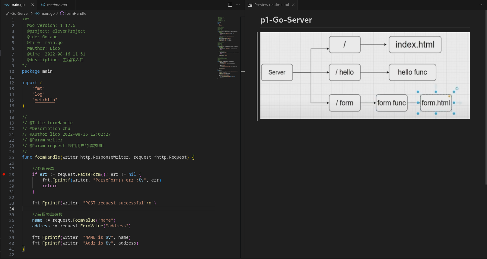
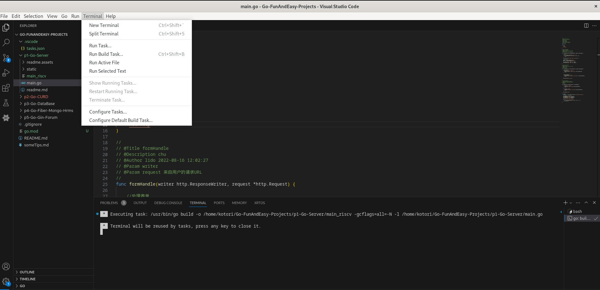
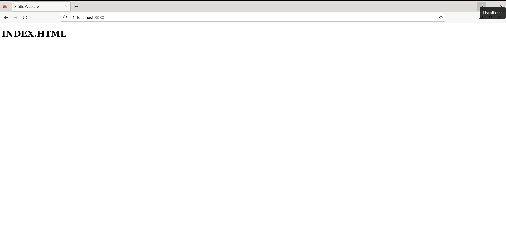
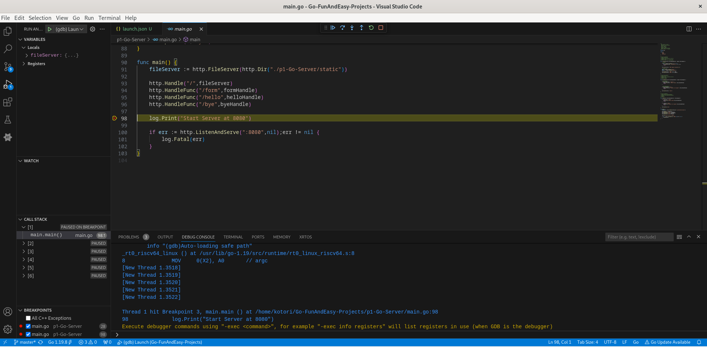

# 基于VS Code 实现Golang 的 RISC-V 开发

## 概述

VS Code 是一个开源的、跨平台的、具有代码自动补全、语法高亮、调试等功能代码编辑器。

RISC-V 是一个开源的、免费、通用的32位和64位 reduced instruction set computer（RISC-V）架构。

Golang 是一个开源的、编译型、并发型、并具有垃圾回收功能的编程语言。

VS Code 本身就支持安装GO插件实现Golang的编译，运行，调试等功能。而Golang本身即支持对不同平台不同架构的交叉编译。故只需少量的一些配置就可实现对RISC-V架构的交叉编译。

## VS Code 相关原理讲解

VS Code 主要通过task.json文件中配置的内容实现一些命令的自动化处理，其中比较广泛的应用便是C/C++的编译，运行，调试等，当然，Golang等语言的编译运行调试也是通过task.json文件的配置实现。在安装插件后便可较为容易的直接生成对应配置的task.json文件。提高开发效率。

VS Code 的调试配置主要通过launch.json文件实现，而Go插件中的调试工具使用的是dlv工具，这个经过尝试在官方仓库中进行编译时其不支持RISC-V架构，故需要使用gdb进行调试，使用交叉编译还需要使用gdb的远程调试功能。

## 环境搭建

### 测试环境

- 操作系统：Debian 12

### 安装Golang，gdb-multich与qemu

```shell
sudo apt-get install golang-go
sudo apt-get install gdb-multiarch
sudo apt-get install qemu-user-static
```

### 安装VS Code 插件

- [Go插件](https://marketplace.visualstudio.com/items?itemName=golang.Go):主要插件，实现交叉编译等功能

- [C/C++插件](https://marketplace.visualstudio.com/items?itemName=ms-vscode.cpptools):使用gdb进行远程调试时需要

打开VS Code，在插件市场搜索并安装这两个插件。

### Golang系统配置

在 VS Code 中，打开命令面板的“帮助>显示所有命令”。 或使用键盘快捷方式（Ctrl+Shift+P），搜索Go: Install/Update tools然后运行该命令，选择所有可用的 Go 工具，然后单击“确定”并等待 Go 工具完成更新。

点击左边栏的Extension-Go-Unisntall旁边的齿轮进入Go语言的系统设置，或点击左边栏的manage-settings 在筛选中输入`@ext:golang.go `进入。

在Go：Tools Env Vars处点击edit in settings.json，在settings.json中自动生成的配置项`go.toolsEnvVars`中添加如下内容：
```json
"GOARCH":"riscv64",
"GOOS":"linux"
```

### Go项目搭建

在VS Code中打开一个对应的空文件夹，在资源管理器面板中单击`New Folder`，然后创建根目录，名字自定，或者导入go项目，这里导入一个简单的webserver项目：



按``ctrl+shift+` ``
打开终端或者菜单栏 `Terminal-New Terminal`
在终端中输入`go mod init ${创建或导入的文件名}`，回车。

### task.json配置以及交叉编译运行

点击`Terminal-Configure Defaulit Build Task` 再点击`go:build package`即可生成如下task.json文件：
```json
{
	"version": "2.0.0",
	"tasks": [
		{
			"type": "go",
			"label": "go: build package",
			"command": "build",
			"args": [
				"${fileDirname}"
			],
			"problemMatcher": [
				"$go"
			],
			"group": {
				"kind": "build",
				"isDefault": true
			},
			"detail": "cd /home/kotori/Go-FunAndEasy-Projects; go build ${fileDirname}"
		}
	]
}
```
修改`args`字段为：
```json
    "args": [
        "-o",
        "${fileDirname}/${fileBasenameNoExtension}_riscv",
        "-gcflags=all=-N -l",
        "${file}"
    ]
```
其中`"${fileDirname}/${fileBasenameNoExtension}_riscv"`一项对应生成文件名， ` "-gcflags=all=-N -l"`对应编译选项，使得编译时不会使代码被优化从而无法调试，`${file}`对应当前打开的文件。

此时点击`Terminal-Run Build Task`即可编译当前文件：



可看到对应文件夹中main_riscv可执行文件生成。

执行对应文件可得：


在浏览器中访问对应端口也可得到结果：



### launch.json配置以及编译调试

点击左边栏的`Run and Debug`，选择`Show all automatic debug configurations`，在弹出的`launch.json`中点击`Add configuration...`，选择 `c/c++:(gdb) launch` 得到如下json：

```json
{
    // Use IntelliSense to learn about possible attributes.
    // Hover to view descriptions of existing attributes.
    // For more information, visit: https://go.microsoft.com/fwlink/?linkid=830387
    "version": "0.2.0",
    "configurations": [
        {
            "name": "(gdb) Launch",
            "type": "cppdbg",
            "request": "launch",
            "program": "enter program name, for example ${workspaceFolder}/a.out",
            "args": [],
            "stopAtEntry": false,
            "cwd": "${fileDirname}",
            "environment": [],
            "externalConsole": false,
            "MIMode": "gdb",
            "setupCommands": [
                {
                    "description": "Enable pretty-printing for gdb",
                    "text": "-enable-pretty-printing",
                    "ignoreFailures": true
                },
                {
                    "description": "Set Disassembly Flavor to Intel",
                    "text": "-gdb-set disassembly-flavor intel",
                    "ignoreFailures": true
                }
            ]
        }
        
    ]
}
```

之后进行如下修改：

- name：可随喜好修改

- program：修改为与上build时args在`-o`一项后面的对应项，如这里为 ` "${fileDirname}/${fileBasenameNoExtension}_riscv"`

- 在配置中添加以下两项：
    ```json
    "miDebuggerPath": "/usr/bin/gdb-multiarch",
    "miDebuggerServerAddress": "localhost:1234"
    ```
其中gdb-multiarch保证日交叉编译的对应调试，可换成riscv工具链的gdb绝对路径

而对应的远程调试端口可以自定。

而后对编译完成后的二进制文件使用qemu开启一个gdbserver：

```shell
qemu-riscv64-static -g 1234 /path/to/elf
```
其中对应的/path/to/elf表示可执行文件的对应路径

然后点击`Run and Debug`, 再点击`Start Debugging`，可进行对应的连接调试：



### 配置task进行自动启动远程gdbserver（可选）

为减少在terminal上的操作，在Task中配置如下（内容模板来在VS Code官网）：

```json
{
    "label": "qemu-static",
    "type": "shell",
    "isBackground": true,
    "command": "/usr/bin/qemu-riscv64-static -g 1234 ${fileDirname}/${fileBasenameNoExtension}_riscv",
    "problemMatcher": []
}
```
然后启动此qemu-static task需要：

上方栏Terminal->Run Task->点击选择qemu-static，由于qemu开启gdbserver会造成阻塞，故运行后可直接开始进行调试或使用lsof查看端口是否被占用。
