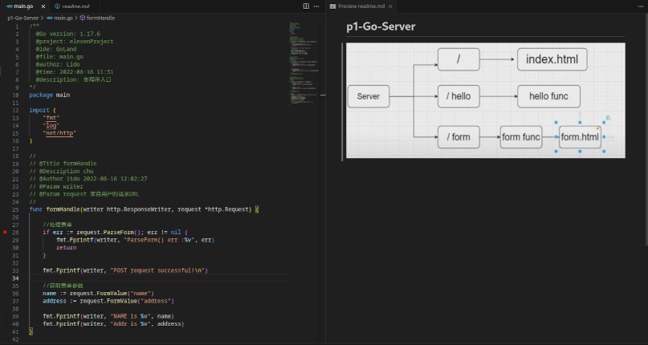
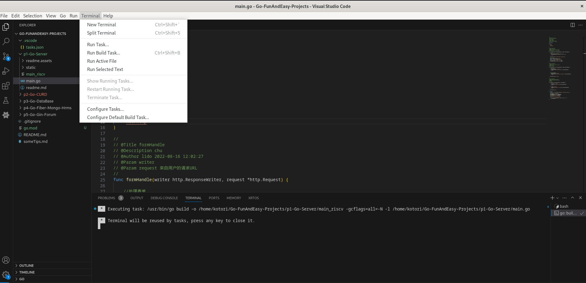
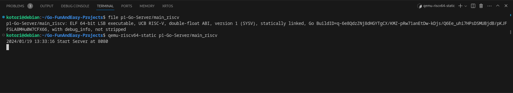
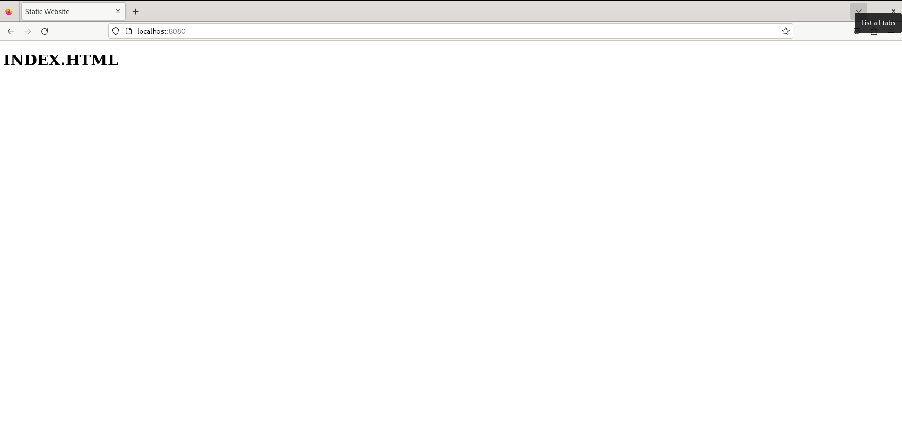
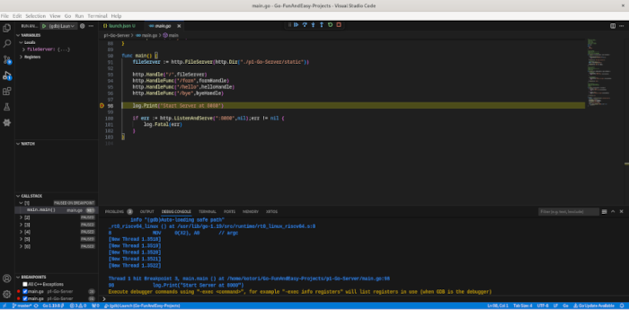

# <center>基于VS Code进行Golang的编译调试
## <center>黄烁

---

# <center>引言

---

### 交叉编译和调试

交叉编译和调试是指在一个平台上编译和调试另一个平台上的程序。这通常需要使用特定的交叉编译工具链和调试器，以及一些配置文件和参数，来指定目标平台的信息和调试模式。

交叉编译和调试的主要目的是为了适应嵌入式系统的开发需求，因为嵌入式系统通常具有有限的存储空间和运算能力，无法在其上进行本地编译和调试。而交叉编译和调试可以提高开发效率和质量，也可以方便地在不同的平台上进行软件的移植和测试。

目前目标平台为RISC-V架构的交叉编译虽然已经有一定程度的支持，但仍没有一个IDE可集中便利地将各种语言对应的交叉编译开发统合在一起，而且使用IDE在RISC-V平台上进行的开发也尚未得到完整，完备的验证，因此在此介绍如何使用VS Code进行Golang的编译和调试。(重点叙述)

---

### Golang简介

Golang 是一种开源的编程语言，由 Google 开发和支持，它能让构造简单、可靠且高效的软件变得容易。Golang 主要用于编写网络服务和云计算相关的软件，例如 Web 服务器，存储集群，微服务，容器，分布式系统等。

Golang 也有许多著名的开源项目，例如：

- Docker - Linux 容器运行时，可以轻松地打包和部署应用程序。
- Kubernetes - 来自 Google 的容器集群管理器，可以实现应用程序的自动化部署、扩展和管理。
- etcd - 一个分布式的、可靠的键值存储，用于配置共享和服务发现。
- gRPC - 一个高性能的、开源的、通用的 RPC 框架，基于 HTTP/2 和 Protocol Buffers。
- Hugo - 一个快速和现代的静态网站生成器，支持 Markdown、HTML、CSS 等格式。

---

### VS Code简介

#### tasks.json & launch.json

为了实现任务的自动化，提高效率，VS Code支持使用tasks.json来配置一些任务，如编译、测试、打包等。

而VS Code同样支持对代码进行调试，只需配置好对应的调试配置，即在调试代码时需要指定的一些参数，如程序路径、调试器路径、调试模式、调试端口等。

可以通过修改这两个文件来自定义一些特定构建和调试过程，也可以通过VS Code的界面来生成和编辑这两个文件。

---

#### VS Code的扩展

VS Code存在可以增强或支持某种编程语言的功能的扩展，如C/C++，它是一个必要的扩展，可以提供C/C++语言的智能提示、语法检查、图形化的调试工具、插件扩展、版本管理等功能。还有Python，Java，Go，Rust等语言的扩展，它们可以提供相应语言的特定功能，如代码运行、代码调试、代码测试、代码分析、代码生成等。安装这些扩展，也可有助于我们生成一些task与调试配置的模板。提高开发对应的效率。

---

# <center>环境搭建

---

### 测试环境

- 操作系统：Debian 12

### 安装Golang，gdb-multich与qemu

```shell
sudo apt-get install golang-go
sudo apt-get install gdb-multiarch
sudo apt-get install qemu-user-static
```

---

### 安装VS Code 插件

- [Go插件](https://marketplace.visualstudio.com/items?itemName=golang.Go):主要插件，实现交叉编译等功能

- [C/C++插件](https://marketplace.visualstudio.com/items?itemName=ms-vscode.cpptools):由于vscode默认调试go的软件为delve,而在RISC-V平台上进行编译时官方仓库显示目前尚未支持该架构，可见[issue](https://github.com/go-delve/delve/issues/3437)，故此处使用gdb进行调试，此插件可有助于提高远程调试时的效率。


---

### Golang系统配置

在 VS Code 中，打开命令面板的“帮助>显示所有命令”。 或使用键盘快捷方式（Ctrl+Shift+P），搜索Go: Install/Update tools然后运行该命令，选择所有可用的 Go 工具，然后单击“确定”并等待 Go 工具完成更新。

点击左边栏的Extension-Go-Unisntall旁边的齿轮进入Go语言的系统设置，或点击左边栏的manage-settings 在筛选中输入`@ext:golang.go `进入。

在Go：Tools Env Vars处点击edit in settings.json，在settings.json中自动生成的配置项`go.toolsEnvVars`中添加如下内容：
```json
"GOARCH":"riscv64",
"GOOS":"linux"
```

---

### Go项目搭建

在VS Code中打开一个对应的空文件夹，创建根目录，名字自定，或者导入go项目，这里导入一个简单的webserver项目：



打开终端,在终端中输入`go mod init ${创建或导入的文件名}`，回车。

---

### task.json配置以及交叉编译运行

点击`Terminal-Configure Defaulit Build Task` 再点击`go:build package`即可生成tasks.json文件：
修改`args`字段为：
```json
    "args": [
        "-o",
        "${fileDirname}/${fileBasenameNoExtension}_riscv",
        "-gcflags=all=-N -l",
        "${file}"
    ]
```
其中`"${fileDirname}/${fileBasenameNoExtension}_riscv"`一项对应生成文件名， ` "-gcflags=all=-N -l"`对应编译选项，使得编译时不会使代码被优化从而无法调试，`${file}`对应当前打开的文件。

---

此时点击`Terminal-Run Build Task`即可编译当前文件：



可看到对应文件夹中main_riscv可执行文件生成。

---

执行对应文件可得：



---

由于演示项目为一个Webserver,在浏览器中访问对应端口可得到：



---

### launch.json配置以及编译调试

点击左边栏的`Run and Debug`，选择`Show all automatic debug configurations`，在弹出的`launch.json`中点击`Add configuration...`，选择 `c/c++:(gdb) launch` 得到对应模板：

之后进行如下修改：

- name：可随喜好修改

- program：修改为与上build时args在`-o`一项后面的对应项，如这里为 ` "${fileDirname}/${fileBasenameNoExtension}_riscv"`

- 在配置中添加以下两项：
    ```json
    "miDebuggerPath": "/usr/bin/gdb-multiarch",
    "miDebuggerServerAddress": "localhost:1234"
    ```
---

### 开始调试

而后对编译完成后的二进制文件使用qemu开启一个gdbserver：

```shell
qemu-riscv64-static -g 1234 /path/to/elf
```

然后点击`Run and Debug`, 再点击`Start Debugging`，可进行对应的连接调试：



---

### 配置task进行自动启动远程gdbserver（可选）

为减少在terminal上的操作，在Task中配置如下（内容模板来在VS Code官网）：

```json
{
    "label": "qemu-static",
    "type": "shell",
    "isBackground": true,
    "command": "/usr/bin/qemu-riscv64-static -g 1234 ${fileDirname}/${fileBasenameNoExtension}_riscv",
    "problemMatcher": []
}
```
然后启动此qemu-static task需要：

上方栏Terminal->Run Task->点击选择qemu-static，由于qemu开启gdbserver会造成阻塞，故运行后可直接开始进行调试或使用lsof查看端口是否被占用。

---

# <center> 总结

---

本篇主要介绍了如何使用VS Code进行RISC-V的编译和调试，并介绍了如何使用launch.json配置进行编译和调试，以及如何使用task进行自动启动远程gdbserver。在其中可看到：

- 目前主流IDE（如VSCode）的目标平台为RISC-V的交叉编译支持情况是尚佳的。

- 不同于RT-Thread-Studio之类的插件，VS Code对交叉编译的支持可能不太完备，需要进行一定的自定义配置，对一些新手的话门槛较高，且qemu之类的远程编译也需要对此进行分开部署。

- 一些主流语言的配套工具可能对RISC-V架构的支持还不太完善，如delve等。

---

# <center> 感谢聆听
