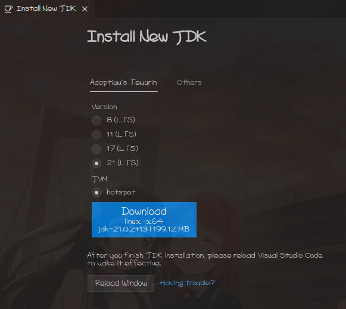
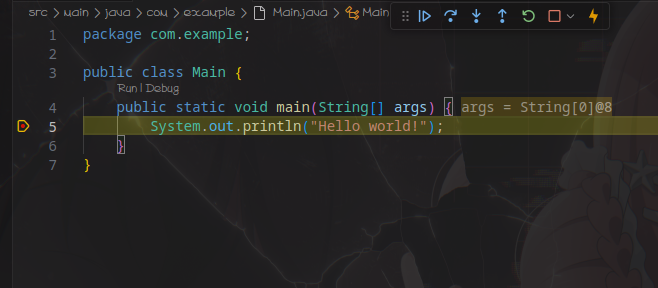
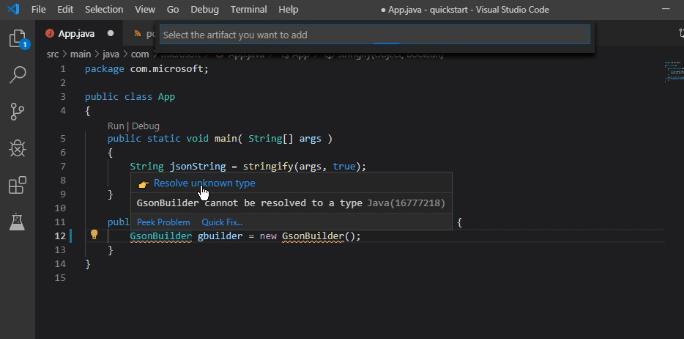
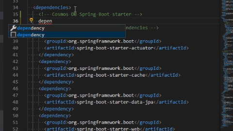

# 
在VS Code 开发JAVA以及其在RISC-V上的支持情况

---

## JAVA简介

Java 是一种广泛使用的编程语言，它具有跨平台、面向对象、高性能、安全等特点。Java 的核心思想是“一次编写，到处运行”，即 Java 程序可以在不同的硬件和操作系统上运行，而无需重新编译。这是因为 Java 程序是编译成字节码（bytecode），而不是直接编译成目标平台的机器码。字节码是一种中间表示，它可以被 Java 虚拟机（JVM）解释执行或动态编译成机器码。JVM 是一种软件，它可以模拟一台抽象的计算机，为 Java 程序提供运行环境。因此，只要目标平台上有相应的 JVM，就可以运行 Java 程序。

---

## JAVA 应用

- Web 应用程序：使用 Spring Boot，Hibernate 等技术，来开发基于 Web 的应用程序，如网站，电商，社交，博客等。

- 桌面应用程序：使用 Java SE，Swing，JavaFX，AWT 等技术，来开发基于桌面的应用程序，如编辑器，浏览器，计算器，画图等。

- 分布式应用程序：使用 EJB，JMS，Dubbo，Spring Cloud 等技术，来开发基于分布式的应用程序，如微服务，中间件，消息队列，RPC 等。

- 大数据应用程序：使用 Hadoop，Spark，Flink，Hive，HBase 等技术，来开发基于大数据的应用程序，如数据仓库，数据分析，数据挖掘，数据可视化等。

---

## JAVA目前主流开发流程

Java 目前主流的开发流程一般包括以下几个步骤：

- 使用集成开发环境（IDE）或编辑器，如 Eclipse，IntelliJ IDEA，VS Code 等，来编写和调试 Java 源代码，通常遵循一些编码规范和风格，如 Google Java Style Guide 等。
- 使用构建工具，如 Maven，Gradle，Ant 等，来自动化编译，测试，打包，部署等过程，通常使用一些配置文件，如 pom.xml，build.gradle，build.xml 等，来管理项目的依赖和插件。
- 使用版本控制系统，如 Git，SVN，Mercurial 等，来管理代码的版本，分支，合并，回滚等操作，通常使用一些平台，如 GitHub，GitLab，Bitbucket 等，来托管和协作代码。

---

## 一些与项目整体管理相关的说明
对于开发者来说，java开发可能只需涉及上述的几个步骤，但作为项目整体管理来说，还需要考虑一些其他方面以保证整个体系的完善，如：
- 使用单元测试框架，如 JUnit，TestNG，Spock 等，来编写和运行单元测试，通常使用一些工具，如 Mockito，PowerMock，Hamcrest 等，来进行模拟，断言，匹配等操作。
- 使用代码质量工具，如 SonarQube，PMD，Checkstyle 等，来检测和改进代码的质量，通常使用一些指标，如代码覆盖率，复杂度，重复度，漏洞，坏味道等，来评估和优化代码。
- 使用持续集成和持续交付（CI/CD）工具，如 Jenkins，Travis CI，CircleCI 等，来自动化构建，测试，部署等流程，通常使用一些脚本，如 Jenkinsfile，.travis.yml，config.yml 等，来定义和执行任务。

---

## Java与RISC-V平台的关系

为了让 Java 程序能够在 RISC-V 平台上运行，需要为 RISC-V 平台提供一个适配的 JVM，即实现了 Java 字节码和 RISC-V 机器码之间的转换。目前，已经有一些项目在进行 RISC-V 的 Java 移植，如 BishengJDK，Dragonwell JDK，OpenJ9 等。

这些项目都是基于 OpenJDK 的 RISC-V 后端实现的，其中 BishengJDK 和 Dragonwell JDK 都支持了 RISC-V 的 C 扩展和 V 扩展，即 RISC-V 的压缩指令和向量指令，这些指令可以提高 RISC-V 的代码密度和性能。OpenJ9 是一个基于 OpenJDK 和 OMR 的 Java 发行版，它使用了 OpenJ9 虚拟机替换了 HotSpot 虚拟机，它目前支持了 RISC-V 的基本指令，但还未支持 JIT 和 AOT

---

## Java 打包以及运行机制

- 目前Java主流项目依赖管理软件Maven/Gradle都是默认打包打出jar包，jar打包是将多个Java类文件和其他资源文件合并成一个文件的打包形式，它有如方便分发和部署的优点，且由于基于jvm运行，其支持跨平台，jar文件可以在任何支持Java的系统上运行。

- 但同样的，由于需要额外的工具和命令来创建和运行jar文件，以及jvm的效率问题。如果jar文件过大，可能会影响程序的启动速度和性能。

---

## Native Image简单介绍分析

- native image是一种将Java代码提前编译为本地平台可执行文件的技术。相较于jvm的“臃肿”特性 ， native image体积小，启动速度快，占用的CPU和内存资源少，适合容器和云部署，而且基于llvm后端，其也可支持交叉编译。

- 目前springboot框架也支持原生使用graalvm进行native image的打包

---

## Native Image简单介绍分析

而相对的native image也存在如下问题：

- 对于开发好的字节码class文件或jar包，其需要在进行打包编译为可执行文件。

- 而若将打包为可执行文件作为开发的一环，则由于其使用llvm后端需要自行编译graalvm，会增加jdk版本的复杂程度，且交叉编译涉及到的各种环境也比较复杂。

- 业界中（如互联网应用开发）实际上许多开发者对其了解不多，其应用范围也相较于jar等主流开发流程要小很多。IDE的各种插件支持也比较匮乏

---

由以上，我们可知，目前Java开发最普遍的情况下，对开发者来说，只需关心其代码的完善，至于相关平台的验证之类的工作，都是通过jvm的特性规避，故其所谓的与交叉编译概念的开发调试均是在本机x86的情况下调试验证即可，而由不同平台的jvm来考虑对应平台之间的差异，对开发者来说，理论上在开发平台上可以调试出预期结果的情况下，在运行部署平台也应为预期行为。即开发者基本无需关心目标平台的特性。只需将最终产物打包为jar即可

---

## Java在VS Code中的开发

Java在VS Code中的支持是十分完善的，使用扩展packet：[Extension Pack for Java](https://marketplace.visualstudio.com/items?itemName=vscjava.vscode-java-pack)，即可获得如下特性：

- 语法高亮
- 代码补全
- 代码格式化
- 调试支持
- 项目管理
- 打包支持

---

## JDK下载更换支持

安装扩展后VS Code支持直接在IDE中下载安装jdk,并更换使用的版本：

---

## 调试支持

调试包含在pack中，只需在对应class中点击debug即可。

---

## Maven/Gradle打包支持

Maven和Gradle都是Java的依赖管理工具，它们可以自动下载和构建依赖项，并生成可执行的jar包。

其项目构建打包也均可在VS Code中进行。

---

## 以Maven为例

- 其支持编写中智能检测并动态添加pom.xml文件中的依赖项，并支持自动下载依赖项。

---

- 在编写pom.xml文件时，其支持自动补全。以及通过输入依赖向直接完成pom文件的修改等功能

---

## 总结

JAVA开发现状：

- 由于jvm特性，目前主流的java开发都与目标平台系统架构无关，开发者只需关心其代码的完善，而无需关心其运行平台。

- 目前VS Code对java的支持十分完善，其支持直接在IDE中下载安装jdk,并更换使用的版本，支持调试，支持打包，支持项目构建，支持依赖管理，支持语法高亮，代码补全，代码格式化等功能。

- 使用llvm后端进行graalvm交叉编译的IDE支持尚不完善

---

# 
感谢
