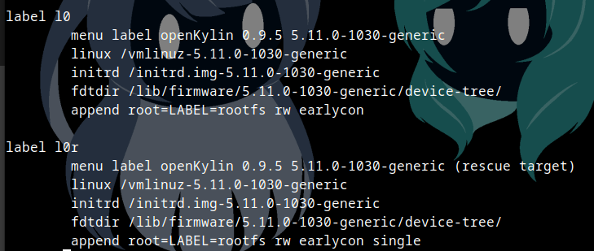
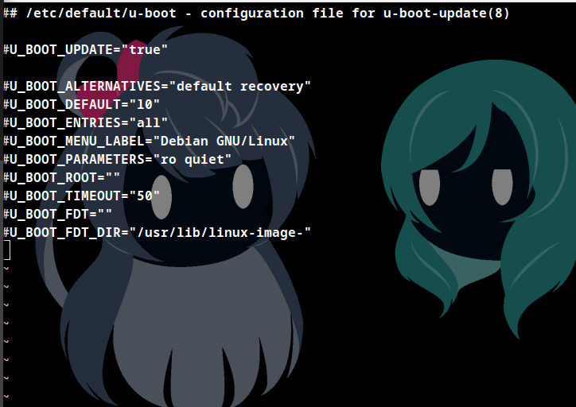

# OpenKylin riscv umatched在qemu下的运行
## 前言
鉴于目前openkylin riscv版本并没有给qemu的镜像，而测试组的各位基本没有umatched之类的开发版，而虽然UbuntuKylin有适配qemu的镜像，但目前openkylin和ubuntukylin使用的软件源仍不同，故出此文档，仅给想在qemu测试相关软件或者体验openkylin的人以作参考。

NOTE：
- 以下运行的host环境为Debian11
- guest镜像使用的是openkylin-0.9.5-hifive-unmatched-riscv64.img
- qemu安装在本文不加叙述，默认qemu已安装完毕，且qemu-system-riscv64使用正常
- 使用qemu版本为7.2.0
## 可行性与测试的合理性
由Ubuntu wiki对riscv的叙述可知，其提供的qemu镜像与umatched的镜像是一致的，证明了在qemu上运行umatched镜像的可行性。

而在Ubuntu，ubuntukylin，anolisos提供的qemu镜像里，都在boot分区里看到了umatched使用的fdt而且启动方式都是使用u-boot启动，镜像内部也是umatched使用较多的extlinux引导启动，可以看为让人和openkylin的文件结构，可以看到：
- 由于同属Debian系，其文件基本结构是一致的
- 而其启动方式也同是extlinux方式引导
- 而不一样的地方在于其引导构建出的内核，软件源，以及预装软件的不同

上述不同点都不影响测试的合理性，而需要的硬件接口也可以由qemu所模拟。

所以根据这些镜像的某些参数让umatched的镜像在qemu上运行并进行测试也应该是可以被认可的。
## 启动前准备
下载镜像并解压
可以去各个大学的镜像站或官网进行下载,这里下载的是最新的0.9.5版本。解压使用unxz命令
```
unxz openkylin-0.9.5-hifive-unmatched-riscv64.img.xz
```
挂载镜像并chroot
由于镜像内含有分区，这里使用losetup+kpartx方式挂载，而使用chroot更改其中的参数更加方便
```
sudo losetup -f  #记住输出的loop编号,以loop4为例
sudo losetup /dev/loop4 /path/to/img #path to img即到img文件的绝对路径或相对路径
lsblk -f  #可看到loop内部的分区，并可以此判断主文件分区是哪一个，有些机型不适用-f，也可不加-f
sudo kpartx -av /dev/loop4  #可以看到分区，这里p4是主文件分区，p3是对于boot分区
sudo mount /dev/mapper/loop4p4 /mnt  #kpartx后的结果在会存在/dev/mapper中
sudo mount /dev/mapper/loop4p3 /mnt/boot
sudo chroot /mnt
```
如遇`chroot failed to run command /bin/bash: no such file or directory`问题，可以尝试`cp /usr/bin/qemu-riscv64-static /mnt/usr/bin `解决

更改extlinux.conf和u-boot参数
```
vi /boot/extlinux/extlinux.conf
```
或使用其他文本编辑命令，若遇到read only的情况可用`chmod +w xxx.conf`，文本修改完记得重新将写权限重新禁止，将label l0下的
```
fdt /xxxxxx.fdt -> fdtdir /lib/firmware/5.11.0-1030-generic/device-tree/
append root=LABEL=rootfs......earlycon -> append root=LABEL=rootfs rw earlycon
```
下方label l0r部分更改方式相同，也可不改，更改后效果如图：



保存退出后，修改/etc/default/u-boot参数
```
vi /etc/default/u-boot
```
将最底下两行没有#开头的删除，更改后：



然后退出：
```
exit
sudo umount /mnt/boot
sudo umount /mnt
sudo kpartx -dv /dev/loop4
sudo losetup -d /dev/loop4
```
## 启动
使用以下指令启动，已附加spice端口(默认12057)和ssh端口(默认12055)
```
qemu-system-riscv64 \
  -nographic -machine virt \
  -smp 8 -m 8G \
  -audiodev spice,id=snd0 \
  -bios none  \
  -kernel u-boot.bin \
  -drive file="$drive",format=qcow2,id=hd0 \
  -object rng-random,filename=/dev/urandom,id=rng0 \
  -device virtio-gpu \
  -device virtio-rng-device,rng=rng0 \
  -device virtio-blk-device,drive=hd0 \
  -device virtio-net-device,netdev=usernet \
  -netdev user,id=usernet,hostfwd=tcp::12055-:22 \
  -device qemu-xhci -usb -device usb-kbd -device usb-tablet -device usb-audio,audiodev=snd0  \
  -device virtio-serial-pci \
  -device virtserialport,chardev=spicechannel0,name=com.redhat.spice.0 \
  -chardev spicevmc,id=spicechannel0,name=vdagent \
  -spice port=12057,disable-ticketing=on
```
也可参见本人根据openEuler riscv qemu启动脚本的[改版](./application/start_vm_openkylin.sh)，主要是将镜像，ssh端口，spice端口提出方便修改。

其中两个问题，一个是u-boot.bin,配置方案有：
- 熟悉的人可以自行编译（本人并不推荐）
- 不熟悉的可以看看自己仓库是否有u-boot，安装后将`-kernel u-boot.bin`改为`-kernel /usr/lib/u-boot/qemu-riscv64_smode/uboot.elf`

如果你的仓库更新过于激进，可能导致u-boot版本过新，启动时可能出现`fdt creation failed`的情况，或是仓库里没有u-boot的情况。
- 此时可下载本仓库的[u-boot.bin](./application/u-boot.bin)，保证这与镜像及启动脚本在同一目录下即可，无需更改参数。

在使用u-boot做引导时`-bios `后一般功能就是引导到对应分区的位置，起一个定位作用，在qemu7.0版本或以上已不需要`-bios`后参数

而qemu7.0以下版本`-bios`参数的问题，配置方案有：
- 可在自己的系统查看是否有opensbi,安装后将`-bios none`改为`-bios /usr/lib/riscv64-linux-gnu/opensbi/generic/fw_jump.elf`即可
- 若没有，可在本仓库下载[fw_dynamic.bin](./application/fw_dynamic.bin)，并将参数改为`-bios fw_dynamic.bin`

启动脚本或输入指令下回车启动系统，开始会让你选择进入那个系统，选择第一个。进入系统后，里面有一个用户名为openkylin，其密码与root密码一致为openkylin。
## 启动后配置

启动后可能会发现无法使用ssh登陆root，而且使用spice远程登陆时桌面加载十分缓慢并提示空间不足。以下为我的解决方案，在终端先root登陆后。
### ssh登陆问题：
```
vi /etc/ssh/sshd_config
``` 
修改sshd_config ，找到`#PermitRootLogin`一行将后面那个改为yes并取消注释,即`PermitRootLogin yes`
然后重启sshd
```
systemctl restart sshd
```
### 桌面卡顿情况

实际上此镜像给用户的空余磁盘空间大概为1G左右。这种情况下本人将磁盘扩容是桌面卡顿问题缓解了许多。故为了测试的需要以及桌面端的正常使用，以下给出我扩容的方案：

- 安装growpart软件

growpart软件在debian系中是在cloud-initramfs-growroot软件包中，但openkylin的软件仓并没有此软件，但经测试，ubuntukylin的对应deb包可在这其中使用并成功扩容，以下为具体安装过程

安装本仓库下cloud-utils所需依赖：[libfuse3-3_3.9.0-2_riscv64.deb](./application/libfuse3-3_3.9.0-2_riscv64.deb)
```
dpkg -i libfuse3-3_3.9.0-2_riscv64.deb
```
使用apt安装cloud-initramfs-growroot所需依赖cloud-utils
```
apt install cloud-utils -y
```
安装本仓库下提供的[cloud-initramfs-growroot](./application/cloud-initramfs-growroot_0.45ubuntu2_all.deb)
```
dpkg -i cloud-initramfs-growroot_0.45ubuntu2_all.deb
```
安装完毕后可使用`growpart --help`查看安装是否完成。
- 将语言环境更改为英文

这两个系统给的默认语言为中文，在执行某些软件时会有些问题，如growpart时便会出现问题，故需更改语言环境为英文

先用 `locale -a` 查看系统语言环境。按下面命令格式更改语言，注销重新登录生效。

加载英文模块
```
locale-gen en_US.UTF-8 && update-locale
```
更改语言（建议LANG LANGUAGE LC_ALL全部更改）
```
update-locale LANG=en_US.UTF-8
update-locale LANGUAGE=en_US.UTF-8
update-locale LC_ALL=en_US.UTF-8
```
然后关闭虚拟机，在host中扩容，这里原镜像8G，扩容到20G
```
qemu-img resize -f raw openkylin-0.9.5-hifive-unmatched-riscv64.img +12G
```
之后再开启虚拟机进行扩容：
```
growpart /dev/vda 4
```
扩容后使用`fdisk -l`可看到扩容情况

扩容文件系统
```
resize2fs /dev/vda
```
运行`lsblk -l`可看到结果

退出虚拟机后压缩img，制成qcow2格式（可选，在硬盘容量吃紧的时候可进行）
```
qemu-img convert -f raw -O qcow2 openkylin-0.9.5-hifive-unmatched-riscv64.img openkylin.qcow2
```
最后压缩回来是8G大小
