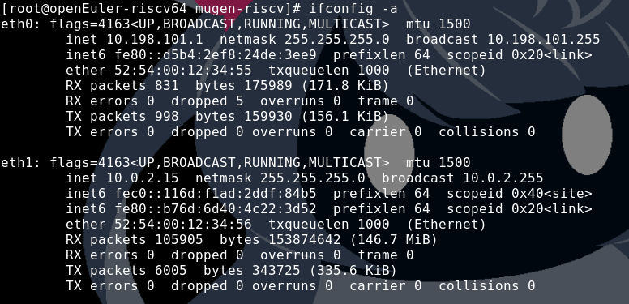
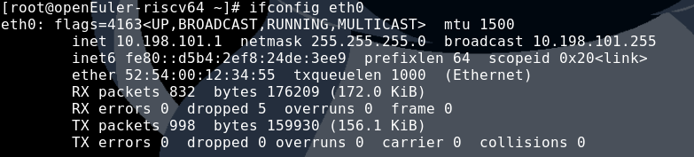
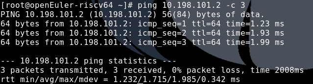

# 在qemu下使用网桥以及tap的方式使得多个虚拟机之间可以互通

在测试中，经常有些场景需要虚拟机之间的互通，而openEuler-riscv提供的脚本使用的网络为用户模式，其配置固然简单，但缺点是其ip无法暴露在外网中，也就只能实现host到guest之间连接，而guest到guest,guest到host则无迹可寻。而针对这种问题，qemu可以使用搭建网桥的方式进行连接，从而使guest的ip能暴露在公网上，实现guest到guest,guest到host的联通，更进一步，可以通过网桥联通外网

- NOTE：本次实验使用环境：debian11.4 内核版本6.0.0 网络使用wifi连接校园局域网
- NOTE：以下命令以`#`开头为root权限下运行，`$`则为普通用户下运行即可
## host上配置网桥以及tap网卡

安装网桥及tap管理工具
```
# apt install bridge-utils uml-utilities
```
启动tun模块（默认启动，如未启动可自行启动）
```
# modprobe tun
```
创建网桥和tap网卡并将其关联
```
# brctl addbr br0                   #br0为网卡名可自行指定
# tunctl -t tap0 -u $(whoami)       #tap0同上，-u参数指定网卡用户，指定为普通用户时启动qemu时可无需sudo

# ip address add 10.198.101.114/24 dev br0  #配置br0的ip
# brctl addif br0 tap0                      #将br0与tap0关联起来
# ip link set dev br0 up
# ip link set dev tap0 up                   #启动网桥网卡
```

## qemu配置

需要添加或更改的参数配置
```
  -netdev tap,id=testap,ifname=tap0,script=no,downscript=no \       #host方面注意不同guest应对应不同tap设备，需要更改ifname
  -device virtio-net-device,netdev=testap,mac=52:54:00:12:34:55 \   #guest方面注意不同guest的mac地址应不同，请自行根据虚拟机以及网卡数量进行配置
```

最后给出整个qemu的配置作为参考
```
qemu-system-riscv64 \
  -nographic -machine virt \
  -smp "$vcpu" -m "$memory"G \
  -kernel "$fw" \
  -bios none \
  -drive file="$drive",format=qcow2,id=hd0 \
  -object rng-random,filename=/dev/urandom,id=rng0 \
  -device virtio-vga \
  -device virtio-rng-device,rng=rng0 \
  -device virtio-blk-device,drive=hd0 \
  -netdev tap,id=testap,ifname=tap0,script=no,downscript=no \
  -device virtio-net-device,netdev=testap,mac=52:54:00:12:34:55 \
  -device virtio-net-device,netdev=usernet,mac=52:54:00:12:34:56 \      #usernet此两行为方便联网而添加可不加
  -netdev user,id=usernet,hostfwd=tcp::"$ssh_port"-:22 \                #可不加
  -device qemu-xhci -usb -device usb-kbd -device usb-tablet -device usb-audio,audiodev=snd0 \
  -append 'root=/dev/vda1 rw console=ttyS0 swiotlb=1 loglevel=3 systemd.default_timeout_start_sec=600 selinux=0 highres=off mem="$memory_append"M earlycon'
```

## guest配置
进入guest后检查NetworkManager模块是否正常，可使用如下指令查看
```
# systemctl status NetworkManager
```
然后使用`# ifconfig -a`查看可用网卡，通过mac地址进行辨认



通过nmcli工具对tap网卡对应的那张网卡进行设置（我这里是eth0）
```
# nmcli c a type ethernet con-name eth0 ifname eth0   #初始化并生成配置文件
# nmcli c m eth0 ipv4.address 10.198.101.1/24         #配置ip，需要和br0的在同一子网网段
# nmcli c m eth0 ipv4.gateway 10.198.101.114          #配置gateway,要和br0的ip一致
# nmcli c m eth0 ipv4.method manual                   #设置网卡ip为静态ip，保证稳定性
# nmcli c up eth0                                     #重启网卡使配置生效
```
运行`# ifconfig eth0`查看效果：



然后将其他guest如法炮制后尝试ping通实验效果:
```
# ping 10.198.101.2 -c 3
```


## brigde的永久配置
以上为比较通用的配置，理论上可推广到其他系统，缺点是重启后配置便会失效，需要重新配置，下面介绍在networking.service中配置网桥及tap的教程（仅限debian系，其他系可使用networkmanager的nmcli工具配置）

以下均在host中/etc/network/interfaces进行配置
- br0的配置
```
auto br0
iface br0 inet static
	address 10.198.101.114
	netmask 255.255.255.0
	bridge_ports all tap0 tap1        #连接其他接口 
	bridge_stp on
```
- tap的配置
```
auto tap0
iface tap0 inet manual
	up ifconfig $IFACE 0.0.0.0 up
	down ifconfig $IFACE down
	tunctl_user minami                #用户的配置
```

## ping通外网的问题
这种ping通其他guest的方法，无法ping通外网，而要使tap网卡可以连接外网，则应使用ip转发的功能，可能由于本机环境问题，其均无法ping通，这里一个解决方法是在装一个使用usernet的网卡，参考上面qemu参数配置。

以下或在本机无法进行验证，或原理上没有问题，却在本机上无法实现，只是贴出链接作为一个引导贴，给需要的人尝试

### 有线网络情况

参见Archwiki-qemu，[物理设备和Tap设备之间通过iptables进行网络共享](https://wiki.archlinuxcn.org/wiki/QEMU?rdfrom=https%3A%2F%2Fwiki.archlinux.org%2Findex.php%3Ftitle%3DQEMU_%28%25E7%25AE%2580%25E4%25BD%2593%25E4%25B8%25AD%25E6%2596%2587%29%26redirect%3Dno#%E7%89%A9%E7%90%86%E8%AE%BE%E5%A4%87%E5%92%8CTap%E8%AE%BE%E5%A4%87%E4%B9%8B%E9%97%B4%E9%80%9A%E8%BF%87iptables%E8%BF%9B%E8%A1%8C%E7%BD%91%E7%BB%9C%E5%85%B1%E4%BA%AB)

### 无线网络情况
以下debianwiki给出两个方法
- 使用etables进行mac地址的伪装转发，参见[Bridging with a wireless NIC](https://wiki.debian.org/BridgeNetworkConnections#Bridging_with_a_wireless_NIC)
- 通过arp代理转发，参见[Bridging Network Connections with Proxy ARP](https://wiki.debian.org/BridgeNetworkConnectionsProxyArp)

## 外部链接
网桥还可使用qemu的netdev bridge选项自动配置tap,可参见[qemu虚拟机间通信配置](https://gitee.com/phoebe-xi/oerv_work/blob/master/hpc/ubuntu+qemu+bridge.md)