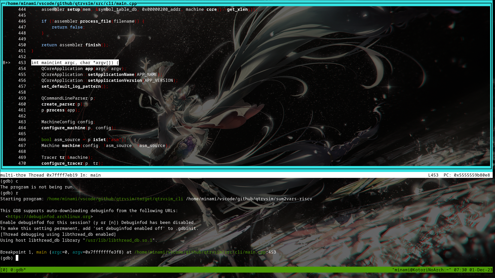
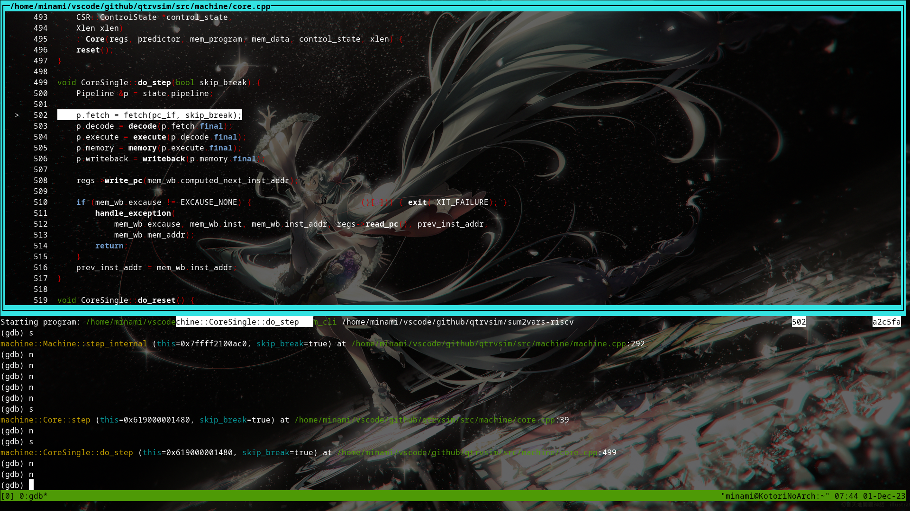
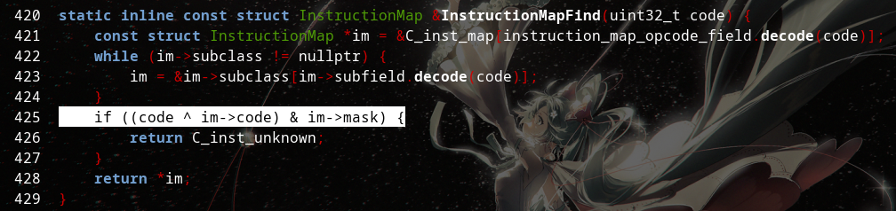
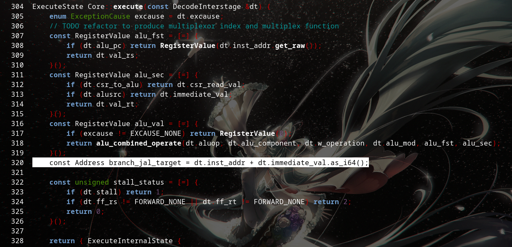

# 使用GDB对qtrvsim进行调试

## 目的

- 学习其具体模拟过程，研究其模拟过程，便于后续开发

- 学习其调试方法，便于后续开发

## 环境

- Archlinux

## 部署步骤

- clone仓库，安装依赖：
    ```bash
    git clone https://github.com/cvut/qtrvsim.git

    sudo pacman -S gcc gdb make qt5-base cmake
    ```

- 配置编译选项，生成Makefile，编译：
    ```bash
    cd qtrvsim
    cmake -DCMAKE_BUILD_TYPE=Debug .

    make
    ```

- 编译完成后已经向qtrvsim_cli中添加了调试信号，以下准备演示程序：
    - sum.c
        ```c
        #include <stdio.h>
        
        int var_a = 0x1234;
        int var_b = 0x2222;
        
        int var_c = 0x3333;
        
        int main()
        {
            var_c = var_a + var_b;
            return 0;
        }
        ```
    - start.S
        ```asm
        .globl   _start
        .text
        .option norelax
        
        _start:
            la x2, _end+0x4000
            la x3, __global_pointer$
            jal  main
            ebreak
        ```
    - 编译(riscv-gnu-toolchain已安装或自编译)：
        ```bash
        riscv64-unknown-elf-gcc -march=rv32i -mabi=ilp32 -nostdlib -c sum.c -o sum2.o
        riscv64-unknown-elf-gcc -march=rv32i -mabi=ilp32 -nostdlib -c start.S -o start.o
        riscv64-unknown-elf-gcc -march=rv32i -mabi=ilp32 -nostdlib sum2.o start.o -o sum2vars-riscv -lgcc
        ```

- 调试：
    ```bash
    gdb ./qtrvsim_cli
    ...
    (gdb) set args sum2vars-riscv
    (gdb) layout src
    (gdb) b main
    (gdb) r
    ```
如下图：
    


进入486行处的machine.play()函数,进而step_internal()->step()->do_step()函数：
    


可看到其取指令，解码，执行，写入，写回等微操作均为对应函数形式，查看其解码函数如下：



可看到其不断对其子域进行解析，对应RISCV ISA指令中对于各字段的解释，即低六位决定opcode,对于不同指令由不同func字段进行进一步对应。

查看其执行函数：



可看到其根据指令类型将ALU两个操作数进行对应设置，即设置第一个操作数为指令提供寄存器的值，或是PC中当前指令地址，而第二个操作数对应寄存器的值，csr寄存器的值与立即数。对应其支持的指令集。

后续memory函数以及writeback函数决定了下一条指令的地址以及目标寄存器的写入，这里不再详细说明。

## 总结

上述通过调试了解了qtrvsim的模拟执行过程，对后续开发调试提供了入门操作。
