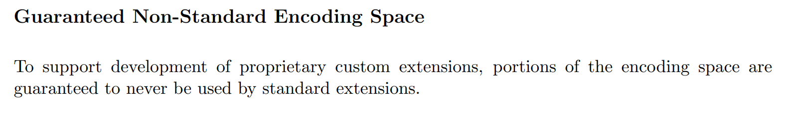
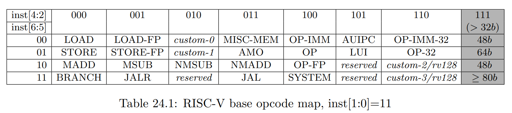
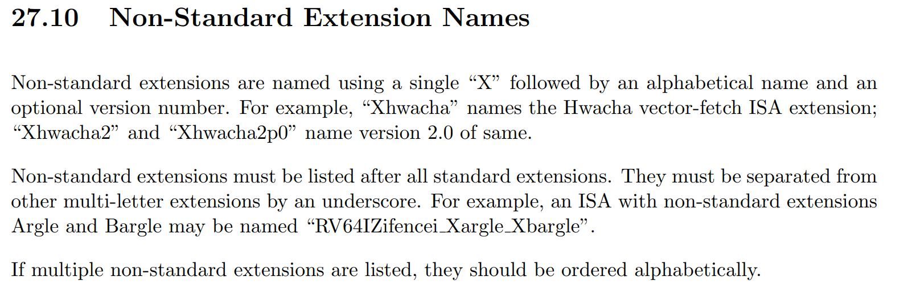
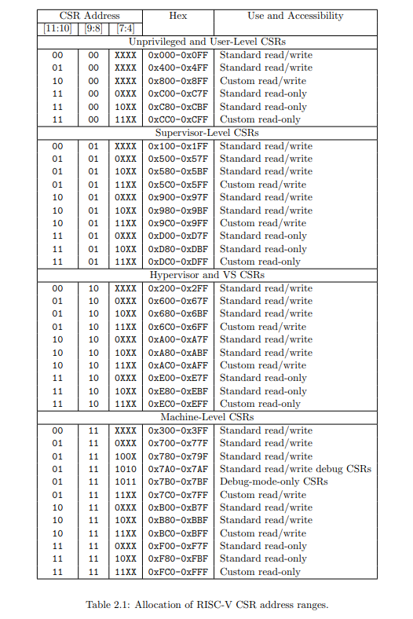

# 如何向Sail中添加新的扩展或CSR相关指令

样例资源来自[RISC-V Technical Session | How to add an extension to RISC-V Sail Model](https://www.youtube.com/watch?v=Um2sFpKMGoc)

## 熟知RISC-V 规范的相关部分

首先，需要浏览 RISC-V 规范的相关部分，看看规范对添加指令有何规定。

让我们从非特权规范开始。

根据规范的第 26 章（“扩展 RISC-V”）描述了如何扩展 RISC-V 指令集。其中存在一条信息如下：



意思是为了支持专有自定义扩展的开发，保证部分编码空间永远不会被标准扩展使用。而这部分的编码空间就是我们想要添加指令的对应编码空间。

而具体的编码可在第24章的编码规则中找到：



可看到RISC-V指令的类型由指令的第2-6位（从0开始计数）决定。而其中custom0与custom1便是上述所说保证不被标准占用的情况。

为保证规范性，RISC-V spec 中同样规定了非标准扩展的命名规则，如27章中所述：



其扩展应以大写X开头为命名，代表非标准扩展。

非特权规范对于自定义的说法大致如上，现在为扩展对应的CSR,我们需要了解对应的特权规范，其中第二章介绍了一张关于CSR寄存器的总表：



其中可看到对应custom字段以及其对应的编码空间。以及其属于什么类型，具有何权限等

## 尝试自定义指令

### 指令说明

这里我们先对需要定义的指令进行说明，我们将定义一个简单的指令，其接受一个立即数,进行0扩展后将其写入自定义CSR寄存器中，其他CSR读指令可以读取该指令，但其他CSR写指令无法写入该寄存器。对应如下说明：

- 指令：xmpl

- CSR寄存器： xmpl_csr

### 代码修改以及创建

在sail-riscv中创建如下代码：

- model/riscv_insts_custom_xmpl.sail：指令的具体定义以及实现
```
union clause ast = XTYPE : (bits(25), xop)
mapping encdec_x_xmpl : xop <-> bits(7) = {
  RISCV_X_XMPL <-> 0b0101011 // inst[6:5] == 01, inst[4:2] == 010 --> custom-0
}
mapping clause encdec = XTYPE(imm, xop)
  <-> imm @ encdec_x_xmpl(xop)
function clause execute (XTYPE(imm, xop)) = {
  let csr_val : bitvector(25, dec) = imm;
  xmpl_csr_2->FieldWARL() = csr_val ;
  RETIRE_SUCCESS
}
mapping x_xmpl_mnemonic : xop <-> string = {
  RISCV_X_XMPL <-> "x.xmpl"
}
mapping clause assembly = XTYPE(imm, xop)
  <-> x_xmpl_mnemonic(xop) ^ " " ^ hex_bits_25(imm)
```

- Makefile：添加编译时需要添加的sail文件

```
SAIL_DEFAULT_INST += riscv_insts_custom_xmpl.sail
```

- model/riscv_csr_map.sail：添加自定义CSR寄存器的编码
```
mapping clause csr_name_map = 0xFC0 <-> "xmpl_csr" 
mapping clause csr_name_map = 0xFC1 <-> "xmpl_2_csr" 
```

- model/iscv_insts_zicsr.sail:添加通用的CSR读函数
```
function readCSR csr : csreg -> xlenbits = {
  let res : xlenbits =
  match (csr, sizeof(xlen)) {
  .
  .
  /* machine mode, custom extension example */
  (0xFC0, _) => xmpl_csr, 
  (0xFC1, _) => xmpl_csr_2.bits(),
  .
  .
``` 

- model/riscv_sys_control.sail:添加CSR生效情况
```
function is_CSR_defined( csr : csreg, p : Privilege) -> bool =
.
.
  /* custom CSRs */
  0xFC0 => p == Machine, 
  0xFC1 => p == Machine, 
.
.
```

添加完毕后，重新编译即可。
```
make ARCH=RV32 csim
```

### 指令测试

编译完成后使用对应编写的程序test.S进行测试：可得到如下结果：

```
.
.
   424	model/riscv_step.sail
   425	model/riscv_step.sail:75.25-75.32
   426	entering step() function...
   427
   428	mem[X,0x80000062] -> 0xD12B
   429	mem[X,0x80000064] -> 0x0DEA
   430	[41] [M]: 0x80000062 (0x0DEAD12B) x.xmpl 1824162
   431
   432
   433	model/riscv_step.sail
   434	model/riscv_step.sail:75.25-75.32
   435	entering step() function...
   436
   437	mem[X,0x80000066] -> 0x21F3
   438	mem[X,0x80000068] -> 0xFC10
   439	[42] [M]: 0x80000066 (0xFC1021F3) csrrs gp, xmpl_2_csr, zero
   440	CSR xmpl_2_csr -> 0x001BD5A2
   441	x3 <- 0x001BD5A2
.
.
```