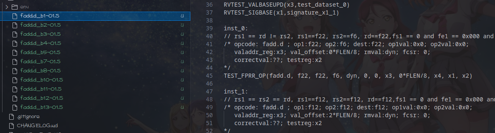

# 使用riscv-ctg生成RV32D/F 扩展的测试

## riscv-ctg的安装

### Python 环境配置 (使用conda+python3.6)

```shell
conda create --name myenv python=3.6
conda activate myenv
```

### 安装riscv-ctg

```shell
git clone https://github.com/riscv/riscv-ctg
cd riscv-ctg
pip3 install --editable .

```

### 代码修改

根据[PR#102](https://github.com/riscv-software-src/riscv-ctg/pull/102)以及测试，riscv-ctg的代码需要进行对应的修改，具体详情：

* riscv_ctg/generator.py:

```
@@ -800,7 +800,7 @@ def eval_inst_coverage(coverpoints,instr):
        else:	                                                                    else:
            var_dict['imm_val'] = toint(instr['imm_val'])	                            var_dict['imm_val'] = toint(instr['imm_val'])
    elif key == 'rm_val':	                                                elif key == 'rm_val':
        var_dict['rm_val'] = toint(rm_dict[instr['rm_val']])	  >                 var_dict['rm_val'] = rm_dict[instr['rm_val']]
    else:	                                                                else:
        var_dict[key] = toint(instr[key])	                                        var_dict[key] = toint(instr[key])
for key in self.op_vars:	                                            for key in self.op_vars:

```

### 生成测试

```shell
riscv-ctg --base-isa rv64i --flen 32 --cgf ./sample_cgfs/dataset.cgf --cgf ./sample_cgfs/sample_cgfs_fext/RV32D/fadd.d.cgf -d ./tests/ --randomize -v debug -p2
```

### 生成结果


