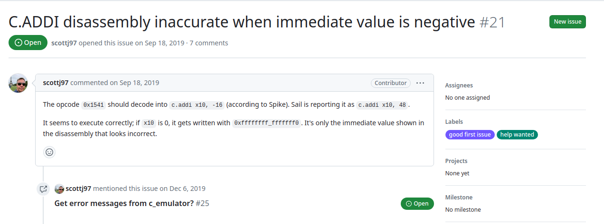
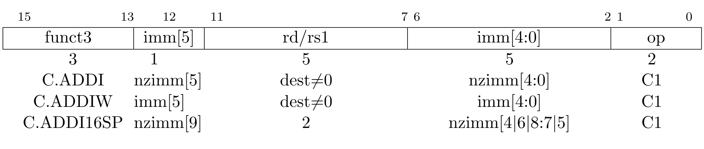

# <center> Sail Issue 分析解决及其中机理分析

## <center>黄烁 
### <center> 2024-4-24

---

## Issue详情

* Issue链接：[#21](https://github.com/riscv/sail-riscv/issues/21)

  <p align="center">
    
  </p>

---

* Issue详情：

  根据riscv spec , 对于RISC-V C 扩展中的指令：

  <p align="center">
    
  </p>

---

* Issue分析：

  又对于Issue中提到的指令码0x1541，即二进制码：

  ```
  0001 0101 0100 0001
  也即：
  000 1 01010 10000 01
  ```

  根据RISC-V中的定义，这将被解码为：

  ```asm
  c.addi x10,-16
  ```

  然而，在sail-riscv中，他解码的输出是：

  ```asm
  c.addi x10,0x30
  ```

  这显然违背了我们直观的理解，但实际运行中，存入x10寄存器中的确实是-16,而非0x30

---

## Issue原因分析

* c.addi部分代码：

  ```
  union clause ast = C_ADDI : (bits(6), regidx)
  mapping clause encdec_compressed = C_ADDI(nzi5 @ nzi40, rsd)
        if nzi5 @ nzi40 != 0b000000 & rsd != zreg
    <-> 0b000 @ nzi5 : bits(1) @ rsd : regidx @ nzi40 : bits(5) @ 0b01
        if nzi5 @ nzi40 != 0b000000 & rsd != zreg
  function clause execute (C_ADDI(nzi, rsd)) = {
    let imm : bits(12) = sign_extend(nzi);
    execute(ITYPE(imm, rsd, rsd, RISCV_ADDI))
  }
  mapping clause assembly = C_ADDI(nzi, rsd)
        if nzi != 0b000000 & rsd != zreg
    <-> "c.addi" ^ spc() ^ reg_name(rsd) ^ sep() ^ hex_bits_6(nzi)
        if nzi != 0b000000 & rsd != zreg
  ```
  可看到，其中汇编部分的mapping调用了hex_bits_6()函数，而在执行部分中，他使用 sign_extend()函数将nzi扩展为12位，然后在调用ITYPE的addi指令的执行，所以其结果为正确的，但问题出在汇编的转换部分。

---

* hex_bits.sail部分代码：

  ```
  val "parse_hex_bits" : forall 'n, 'n > 0. (int('n), string) -> bits('n)
  val "valid_hex_bits" : forall 'n, 'n > 0. (int('n), string) -> bool

  val hex_bits : forall 'n, 'n > 0. bits('n) <-> (int('n), string)

  function hex_bits_forwards(bv) = (length(bv), hex_str(unsigned(bv)))
  function hex_bits_forwards_matches(bv) = true

  function hex_bits_backwards(n, str) = parse_hex_bits(n, str)
  function hex_bits_backwards_matches(n, str) = valid_hex_bits(n, str)

  ...
  mapping hex_bits_6 : bits(6) <-> string = { hex_bits(6, s) <-> s }
  ...

  ```
---

  可看到，其中hex_bits_6 的运行实际上为将bits(6) 转变为 hex_bits的元组，然后将元组中第二个元素提取出来作为转变后的str,其中调用到了string.sail中的hex_str()函数进行转变，而出现问题的情况就是在调用该函数是将对应的输入转变为unsigned无符号数，而riscv spec中c.addi的imm为有符号数，所以导致其转变后的结果为错误的。或者在限定得知立即数位数为6时才可算作正确

---

## Issue解决方案分析

* 添加16进制转换的位扩展的函数：
  对于此问题，一个比较简单的解决方法便是添加对应位扩展的16进制函数，同时将调用对应地方的函数修改，使得汇编显示正确化，但这涉及另一个方面问题，即位扩展扩展的位数和最后sail输出的汇编代码的美观性问题难以界定，且除非根据处理器位数将整个对应值打出，否则其打印的结果仍然不严谨;
* 使用10进制的转换函数替换16进制转换函数：
  既然16进制显示存在位数难以界定的方式，我们可以使用我们较为熟悉的10进制的转换映射方式，一方面，在string.sail中存在dec_str()函数，可以将我们的bits转换为10进制，另一方面，在试运行后，其转换效果也是较好的，但存在问题是，由于命名上的问题，以及调用16进制转换函数的部分过多，导致我们不能通过更改后端的方式来一步到位，或者说需要与sail上游相关开发人员进行确认后才能进行下一步动作;

---

## 解决方案实现

* 针对16进制进行修改，将有符号数自行转为符号加无符号数：
  由于sail中hex_str实现方式问题，我们输入的只能是无符号数，故我们需要自行将有符号数根据正负号进行转换，然后使用hex_str()函数进行转换，同时在双向映射的函数中对此进行处理。

---

## 解决方案实现分析


* sail中hex_bits的定义如上，其中的forward函数调用到了string.sail中的hex_str()函数，我们进一步查看一下hex_str()函数的OCaml实现：
  ```
  let to_lower_hex_char n = if 10 <= n && n <= 15 then Char.chr (n + 87) else Char.chr (n + 48)
  ...
  let hex_str_helper to_char x =
    if Big_int.equal x Big_int.zero then "0x0"
    else (
      let x = ref x in
      let s = ref "" in
      while not (Big_int.equal !x Big_int.zero) do
        let lower_4 = Big_int.to_int (Big_int.bitwise_and !x (Big_int.of_int 15)) in
        s := String.make 1 (to_char lower_4) ^ !s;
        x := Big_int.shift_right !x 4
      done;
      "0x" ^ !s
    )

  let hex_str = hex_str_helper to_lower_hex_char
  ```
  可看到其执行过程中只考虑了对应为纯数字的情况，而对于有符号数，我们还需要处理他的符号问题

---

* sail中对应hex_bits的backwards的实现是引用了sail OCaml lib 中的parser_hex_bits函数，其相关定义如下：
  ```
  let valid_hex_bits (_, s) =
    let len = String.length s in
    (* We must have at least the 0x prefix, then one character *)
    if len < 3 || String.sub s 0 2 <> "0x" then false
    else (
      let hex = String.sub s 2 (len - 2) in
      let is_valid = ref true in
      String.iter (fun c -> is_valid := !is_valid && is_hex_char c) hex;
      !is_valid
    )

  let parse_hex_bits (n, s) =
    if not (valid_hex_bits (n, s)) then zeros n
    else bits_of_string (String.sub s 2 (String.length s - 2)) |> List.rev |> Util.take (Big_int.to_int n) |> List.rev

  ```
---

### 解决方案实现解析

* 可看到原函数的核心实现依赖于上游后端，而我们如要判断其是否为负数在进行对应转换的话，可进行如下编写：
  ```
  function hex_bits_signed_forwards(bv) = {
    if signed(bv) < 0 
    then (length(bv) , concat_str("-" , hex_str(unsigned(not_vec(bv)+1))))
    else (length(bv) , hex_str(unsigned(bv)))
  }
  function hex_bits_signed_forwards_matches(bv) = true
  ```

---

* 同上机理我们可以得到对应的backwards函数：
  ```
  function parse_hex_bits_signed(n, str) = {
    if string_take(str , 1) == "-"
    then {
      let str_ = string_drop(str , 1) ;
      let bv = parse_hex_bits(n, str_);
      not_vec(bv)+1
    }
    else parse_hex_bits(n, str)
  }

  function valid_hex_bits_signed(n, str) ={ 
    let len = string_length(str);
    if string_take(str , 1) == "-"
    then valid_hex_bits(n, string_drop(str , 1))
    else valid_hex_bits(n, str)
  }
  ```
  
* 最后对相关部分进行对应编写，并将对应函数调用部分进行修改，即可得到正确的汇编显示

---

## 总结

* 此次分享中从sail-riscv仓库一个Issue为出发点，逐步分析其原因，同时剖析其源码实现，并尝试给出解决方案，并将其应用到sail-riscv中，使得其能够正常运行，并得到正确的汇编显示

* 目前也是向上游提出了相关pr,等待review中

---
# <center> Thanks