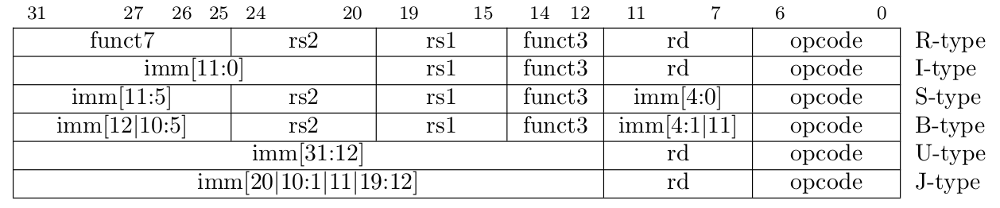

# SAIL-RISCV 各文件的组成以及与 RISCV ISA的对应

## 文件组成

sail-riscv对ISA实现中均存在于目录的model文件夹中：
    
    ```
    model/
    ├── main.sail
    ├── prelude_mapping.sail
    ├── prelude_mem_metadata.sail
    ├── prelude_mem.sail
    ├── prelude.sail
    ├── README.md
    ├── riscv_addr_checks_common.sail
    ├── riscv_addr_checks.sail
    ├── riscv_analysis.sail
    ├── riscv_csr_ext.sail
    ├── riscv_csr_map.sail
    ├── riscv_decode_ext.sail
    ├── riscv_ext_regs.sail
    ├── riscv_fdext_control.sail
    ├── riscv_fdext_regs.sail
    ├── riscv_fetch_rvfi.sail
    ├── riscv_fetch.sail
    ├── riscv_flen_D.sail
    ├── riscv_flen_F.sail
    ├── riscv_freg_type.sail
    ├── riscv_insts_aext.sail
    ├── riscv_insts_base.sail
    ├── riscv_insts_begin.sail
    ├── riscv_insts_cdext.sail
    ├── riscv_insts_cext.sail
    ├── riscv_insts_cfext.sail
    ├── riscv_insts_dext.sail
    ├── riscv_insts_end.sail
    ├── riscv_insts_fext.sail
    ├── riscv_insts_hints.sail
    ├── riscv_insts_mext.sail
    ├── riscv_insts_next.sail
    ├── riscv_insts_rmem.sail
    ├── riscv_insts_vext_arith.sail
    ├── riscv_insts_vext_fp.sail
    ├── riscv_insts_vext_mask.sail
    ├── riscv_insts_vext_mem.sail
    ├── riscv_insts_vext_red.sail
    ├── riscv_insts_vext_utils.sail
    ├── riscv_insts_vext_vm.sail
    ├── riscv_insts_vext_vset.sail
    ├── riscv_insts_zba.sail
    ├── riscv_insts_zbb.sail
    ├── riscv_insts_zbc.sail
    ├── riscv_insts_zbkb.sail
    ├── riscv_insts_zbkx.sail
    ├── riscv_insts_zbs.sail
    ├── riscv_insts_zfa.sail
    ├── riscv_insts_zfh.sail
    ├── riscv_insts_zicond.sail
    ├── riscv_insts_zicsr.sail
    ├── riscv_insts_zkn.sail
    ├── riscv_insts_zks.sail
    ├── riscv_jalr_rmem.sail
    ├── riscv_jalr_seq.sail
    ├── riscv_mem.sail
    ├── riscv_misa_ext.sail
    ├── riscv_next_control.sail
    ├── riscv_next_regs.sail
    ├── riscv_pc_access.sail
    ├── riscv_platform.sail
    ├── riscv_pmp_control.sail
    ├── riscv_pmp_regs.sail
    ├── riscv_pte.sail
    ├── riscv_ptw.sail
    ├── riscv_regs.sail
    ├── riscv_reg_type.sail
    ├── riscv_softfloat_interface.sail
    ├── riscv_step_common.sail
    ├── riscv_step_ext.sail
    ├── riscv_step_rvfi.sail
    ├── riscv_step.sail
    ├── riscv_sync_exception.sail
    ├── riscv_sys_control.sail
    ├── riscv_sys_exceptions.sail
    ├── riscv_sys_regs.sail
    ├── riscv_termination_common.sail
    ├── riscv_termination_rv32.sail
    ├── riscv_termination_rv64.sail
    ├── riscv_types_common.sail
    ├── riscv_types_ext.sail
    ├── riscv_types_kext.sail
    ├── riscv_types.sail
    ├── riscv_vext_control.sail
    ├── riscv_vext_regs.sail
    ├── riscv_vlen.sail
    ├── riscv_vmem_common.sail
    ├── riscv_vmem_rv32.sail
    ├── riscv_vmem_rv64.sail
    ├── riscv_vmem_sv32.sail
    ├── riscv_vmem_sv39.sail
    ├── riscv_vmem_sv48.sail
    ├── riscv_vmem_tlb.sail
    ├── riscv_vmem_types.sail
    ├── riscv_vreg_type.sail
    ├── riscv_xlen32.sail
    ├── riscv_xlen64.sail
    └── rvfi_dii.sail
    ```
其结构比较松散，各个文件均负责对ISA中一些要素的定义，由于sail为重类型语言，ISA各种要素均会被定义为一种具体的类型进行区分，同时，也需要定义此要素到其他桃要素的接口函数以及其实现。

在编译时，多个.sail文件一般会被认为是一个文件，所以每个文件之间都有或多或少的相互联系，举指令的定义执行为例子，可如下面的图来表示：
    


以下结合sail-riscv的代码来进行说明：

## 处理器位宽的定义

见model/riscv_xlen64.sail:
```
/* Define the XLEN value for the architecture. */

type xlen       : Int = 64
type xlen_bytes : Int = 8
type xlenbits         = bits(xlen)
```

上式定义了类型 xlen 指代处理器最大的位宽，类型 xlen_bytes 指代处理器单位字节数，类型 xlenbits 指代一次能读到的数据，为64位的二进制字节。

## 寄存器和寄存器存储数值定义

### 寄存器中的值
见model/riscv_reg_type.sail:
```
/* default register type */
type regtype = xlenbits

/* default zero register */
let zero_reg : regtype = zero_extend(0x0)

/* default register printer */
val RegStr : regtype -> string
function RegStr(r) = BitStr(r)

/* conversions */

val regval_from_reg : regtype -> xlenbits
function regval_from_reg(r) = r

val regval_into_reg : xlenbits -> regtype
function regval_into_reg(v) = v
```

上面定义了类型 regtype 指代寄存器中的值，函数 regval_from_reg 主要是将寄存器转换为 xlenbits 类型，RegStr类型主要是将regtype的二进制编码转化为对应字符串。这里还提前定义了RISC-V中一个恒为0的寄存器的值 zero_reg，其值为 0x0进行零扩展的结果。

### 具体寄存器定义以及读取写入

见model/riscv_regs.sail:

```
val rX : forall 'n, 0 <= 'n < 32. regno('n) -> xlenbits
function rX r = {
  let v : regtype =
    match r {
      0 => zero_reg,
      1 => x1,
      2 => x2,
      ...
      29 => x29,
      30 => x30,
      31 => x31,
      _  => {assert(false, "invalid register number"); zero_reg}
    };
  regval_from_reg(v)
}
```
上面实际上定义了一个函数(function)，其中其先让v这个regtype的变量根据r的值进行match到前面在riscv_regs.sail中定义的32个寄存器，然后通过regval_from_reg函数将寄存器类型转变为数值类型并返回

写入的函数定义与上面的相似，都是先match在进行接下来的操作，而操作由函数定义实现，只不过在写入时定义了可将写入的情况打印使得寄存器值变化更加直观的分支：
```
  if (r != 0) then {
     rvfi_wX(r, in_v);
     if   get_config_print_reg()
     then print_reg("x" ^ string_of_int(r) ^ " <- " ^ RegStr(v));
  }
```

在实际的运行中，为了简化符号，sail使用了重载来对上面的读写进行统一化：
```
overload X = {rX_bits, wX_bits, rX, wX}
```
其会根据传入参数进行匹配对应的函数

### 指令结构定义

sail的指令定义是分别说明的，在RISC-V ISA中，对于所有指令，其定义一个基本的框架。而对于某种特定的指令，其字段组成，编码解码，具体执行都会分开说明，而要将这些分开的定义统合起来就需要使用接下来介绍的ast类型：

```
scattered union ast

/* returns whether an instruction was retired, used for computing minstret */
val execute : ast -> Retired
scattered function execute

val assembly : ast <-> string
scattered mapping assembly

val encdec : ast <-> bits(32)
scattered mapping encdec

val encdec_compressed : ast <-> bits(16)
scattered mapping encdec_compressed
```
上面首先定义了ast,其是一个union,及形式上其是立即数imm,寄存器reg,操作码op的结合体，然后其定义了一个映射execute,负责指令的执行，同时返回执行是否成功的状态Retired，assembly负责将指令转换为字符串，即我们在汇编中会用到的指令形式，encdec负责将指令转换为32位编码，对应其定义的机械码，encdec_compressed对应扩展中的压缩编码，后面这些映射在形式上均为双射，每一个均能找到唯一的一个结果对应。

### 指令字段对应的类型定义

RISC-V ISA中对各种指令根据编码方式进行了定义，如下：



- 最低的 7 位决定操作码类型（I型，J型等）。

- funct3 和 funct7 字段（有时是立即字段）通常指定子操作码（即具体某个指令如add,sub等）。

- rs1、rs2 和 rd 字段指定源寄存器和目标寄存器，占 5 位。

- 立即值通常由 imm 指令字段的排列组成。

而sail中对应的定义了这些类型：
```
/* register identifiers */

type regidx  = bits(5)
type cregidx = bits(3)    /* identifiers in RVC instructions */
type csreg   = bits(12)   /* CSR addressing */

...

/* instruction fields */

type opcode = bits(7)
type imm12  = bits(12)
type imm20  = bits(20)

```
其中regidx表示寄存器字段，占5位，cregidx表示RVC指令中的寄存器字段，占3位，opcode表示操作码字段，占7位，imm12表示12位立即数字段，imm20表示20位立即数字段，立即数字段由具体指令决定

### 指令的具体定义

见model/riscv_insts_base.sail中对于I型指令的定义：
```
union clause ast = ITYPE : (bits(12), regidx, regidx, iop)

mapping encdec_iop : iop <-> bits(3) = {
  RISCV_ADDI  <-> 0b000,
  RISCV_SLTI  <-> 0b010,
  RISCV_SLTIU <-> 0b011,
  RISCV_ANDI  <-> 0b111,
  RISCV_ORI   <-> 0b110,
  RISCV_XORI  <-> 0b100
}

mapping clause encdec = ITYPE(imm, rs1, rd, op)
  <-> imm @ rs1 @ encdec_iop(op) @ rd @ 0b0010011

function clause execute (ITYPE (imm, rs1, rd, op)) = {
  let rs1_val = X(rs1);
  let immext : xlenbits = sign_extend(imm);
  let result : xlenbits = match op {
    RISCV_ADDI  => rs1_val + immext,
    RISCV_SLTI  => zero_extend(bool_to_bits(rs1_val <_s immext)),
    RISCV_SLTIU => zero_extend(bool_to_bits(rs1_val <_u immext)),
    RISCV_ANDI  => rs1_val & immext,
    RISCV_ORI   => rs1_val | immext,
    RISCV_XORI  => rs1_val ^ immext
  };
  X(rd) = result;
  RETIRE_SUCCESS
}

mapping itype_mnemonic : iop <-> string = {
  RISCV_ADDI  <-> "addi",
  RISCV_SLTI  <-> "slti",
  RISCV_SLTIU <-> "sltiu",
  RISCV_XORI  <-> "xori",
  RISCV_ORI   <-> "ori",
  RISCV_ANDI  <-> "andi"
}

mapping clause assembly = ITYPE(imm, rs1, rd, op)
  <-> itype_mnemonic(op) ^ spc() ^ reg_name(rd) ^ sep() ^ reg_name(rs1) ^ sep() ^ hex_bits_12(imm)

```
其中首先对ast定义的一个实现为12个bit和两个寄存器和一个iop的组合，其中iop在riscv_type.sail进行定义，在映射encdec_iop中也可看到其中的定义;

然后其使用encdec进行机器码和ast之间的映射，其中@为链接符号，对应上图的I型的排列;

然后定义execute的一个实现，先取出rs1的值，将imm的值进行符号扩展，然后根据iop进行map作对应的运算，其运算也是在prelude.sail中定义的;

最后定义一个assembly的实现，将imm的值转换为12个bit，将op的值转换为对应的汇编指令名称（itype_mnemonic），最后使用^进行连接，使用spc()返回空格，使用sep()返回逗号，得到汇编指令。

