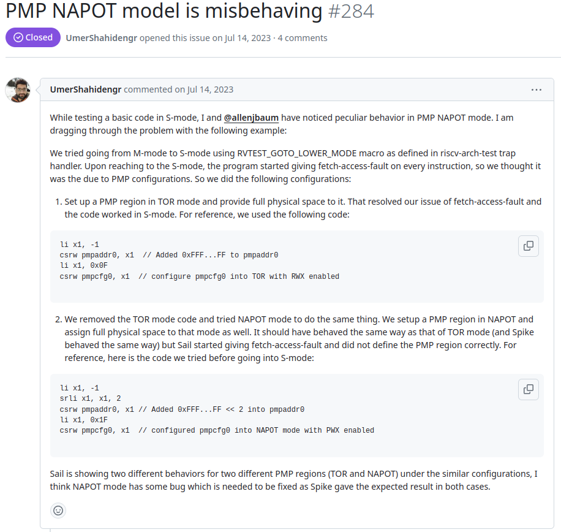

# 验证Sail-RISCV 中一个pmp 地址声明的bug

## Issue 详情



简单概括为在进入到S-mode中时，sail出现了fetch-access-fault 的报错，经过判断可知为pmp 配置问题，但在使用TOR与NAPOT两种配置pmp的方法进行配置后，TOR形式的配置可以成功使得Sail model进入S-mode,但使用NAPOT模式进行配置时，Sail依然会进行报错，而这体现了两者配置模式下存在实现中的漏洞

## 问题复现

### riscv-arch-test 下的切换宏

其包含在env/arch_test.h头文件中，

```asm
.macro RVTEST_GOTO_LOWER_MODE LMODE
.option push
.option norvc
...
#else                           /* XLEN=64, maybe 128? FIXME for 128    */
  .if ((\LMODE\()==Smode) || (\LMODE\()==Umode)) /* lv V unchanged here  */
    LI(  T4,  MSTATUS_MPP)      /* but always clear PP                  */
  .else
    LI(  T4, (MSTATUS_MPP | MSTATUS_MPV))       /* clr V and P          */
  .endif
...
  csrr   sp, CSR_MSCRATCH       /* ensure sp points to Mmode datae area */
          /**** mstatus MPV and PP now set up to desired mode    ****/
          /**** set MEPC to mret+4; requires relocating the pc   ****/
  .if     (\LMODE\() == Vmode)     // get trapsig_ptr & init val up 2 save areas (M<-S<-V)
          LREG    T1, code_bgn_off + 2*sv_area_sz(sp)
  .elseif (\LMODE\() == Smode)     // get trapsig_ptr & init val up 1 save areas (M<-S)
        LREG    T1, code_bgn_off + 1*sv_area_sz(sp)
  .else                            // get trapsig ptr & init val for this Mmode, (M)
          LREG    T1, code_bgn_off + 0*sv_area_sz(sp)
  .endif
          LREG    T4, code_bgn_off(sp)
...
```

必须使用其配套的模型设置宏，并且在调用前需要将当前基地址(栈底)存入`mscratch`寄存器中：

```asm
li x3, 0x1000
csrw mscratch, x3
RVTEST_GOTO_LOWER_MODE Smode     
```

可从其反汇编代码看出其调用及计算过程

```
00000000800003e0 <rvtest_code_begin>:
    800003e0:	6185                	lui	gp,0x1
    800003e2:	34019073          	csrw	mscratch,gp
    800003e6:	fff00493          	li	s1,-1
    800003ea:	03e4d493          	srl	s1,s1,0x3e
    800003ee:	00b49493          	sll	s1,s1,0xb
    800003f2:	3004b073          	csrc	mstatus,s1
    800003f6:	00100493          	li	s1,1
    800003fa:	00b49493          	sll	s1,s1,0xb
    800003fe:	3004a073          	csrs	mstatus,s1
    80000402:	34002173          	csrr	sp,mscratch
    80000406:	47013303          	ld	t1,1136(sp)
    8000040a:	1d813483          	ld	s1,472(sp)
    8000040e:	40930333          	sub	t1,t1,s1
    80000412:	01030313          	add	t1,t1,16
    80000416:	00000497          	auipc	s1,0x0
    8000041a:	006484b3          	add	s1,s1,t1
    8000041e:	341494f3          	csrrw	s1,mepc,s1
    80000422:	30200073          	mret

```

其中两个与sp相关的load指令中的数值为宏中定义的当前代码位置对应偏移计算的结果，由此计算可将调用宏后下一条指令的地址写入mret中，从而实现无缝跳转.由此可得[测试程序](./tests_NAPOT/src/test_default.S)

### Sail C emulator 的pmp 配置

如果直接使用sail编译的模拟器直接运行上面的代码编译出来的结果，其不会产生fetch-access-fault 的报错，究其原因为sail 默认并不启用pmp 保护配置，即其pmp-count 为0, 在这里查看sail 源码中对此的定义

```C
    case OPT_PMP_COUNT:
      pmp_count = atol(optarg);
      fprintf(stderr, "PMP count: %" PRIu64 "\n", pmp_count);
      if (pmp_count != 0 && pmp_count != 16 && pmp_count != 64) {
        fprintf(stderr, "invalid PMP count: must be 0, 16 or 64");
        exit(1);
      }
      rv_pmp_count = pmp_count;
      break;
```

其声明了此参数对用的要求，故在使用此参数启动后：

```
  riscv_sim_RV64 --pmp-count=16 test_default.S
```

可得测试[log](./tests_NAPOT/log/test_default.log)

```
[267] [M]: 0x0000000080000416 (0x00000497) auipc s1, 0x0
x9 <- 0x0000000080000416
mem[X,0x000000008000041A] -> 0x84B3
mem[X,0x000000008000041C] -> 0x0064
[268] [M]: 0x000000008000041A (0x006484B3) add s1, s1, t1
x9 <- 0x0000000080000426
mem[X,0x000000008000041E] -> 0x94F3
mem[X,0x0000000080000420] -> 0x3414
[269] [M]: 0x000000008000041E (0x341494F3) csrrw s1, mepc, s1
CSR mepc -> 0x0000000000000000
CSR mepc <- 0x0000000080000426 (input: 0x0000000080000426)
x9 <- 0x0000000000000000
mem[X,0x0000000080000422] -> 0x0073
mem[X,0x0000000080000424] -> 0x3020
[270] [M]: 0x0000000080000422 (0x30200073) mret
CSR mstatus <- 0x0000000A00000080
ret-ing from M to S
trapping from S to M to handle fetch-access-fault
handling exc#0x01 at priv M with tval 0x0000000080000426
CSR mstatus <- 0x0000000A00000800
within_phys_mem: 0x0000000000000000 not within phys-mem:
  plat_rom_base: 0x0000000000001000
  plat_rom_size: 0x0000000000001000
  plat_ram_base: 0x0000000080000000
  plat_ram_size: 0x0000000004000000
trapping from M to M to handle fetch-access-fault
handling exc#0x01 at priv M with tval 0x0000000000000000
CSR mstatus <- 0x0000000A00001800
within_phys_mem: 0x0000000000000000 not within phys-mem:
  plat_rom_base: 0x0000000000001000
  plat_rom_size: 0x0000000000001000
  plat_ram_base: 0x0000000080000000
  plat_ram_size: 0x0000000004000000
```

其在mret后出现对应报错，至此，该Iuuse的初步验证完成

### 进一步复现

当使用对应的[TOR](./tests_NAPOT/src/test_TOR.S) 和[NAPOT](./tests_NAPOT/src/test_NAPOT.S) 方式对pmp 进行设定时,对应的log表现相同（详见[log_TOR](./tests_NAPOT/log/test_TOR.log) 以及 [log_NAPOT](./tests_NAPOT/log/test_NAPOT.log), 故对此可初步认为其修复完成，并将此结论commit 至对应Issue，得到答复，此bug可能为sail model 在32位模式下并没有使用真正的spec 定义中的34位物理地址，而是使用32位地址并右移两位做为对应的范围界定，这将导致数值的溢出从而导致bug, 对应的已得到修复: [commit](https://github.com/riscv/sail-riscv/commit/a71fee30035e6d504b156cda0802902345766e70), 并请求针对对应commit 前后进行验证。

使用riscv32-unknown-gnu-linux-gcc 对对应NAPOT源码进行编译后，再使用此commit前后编译出的32位的model 进行运行，可得到如下[log_before](./tests_NAPOT/RV32/log/log_before), [log_after](./tests_NAPOT/RV32/log/log_after), 至此回复后，此带有bug 标签的Issue 已经被关闭。
