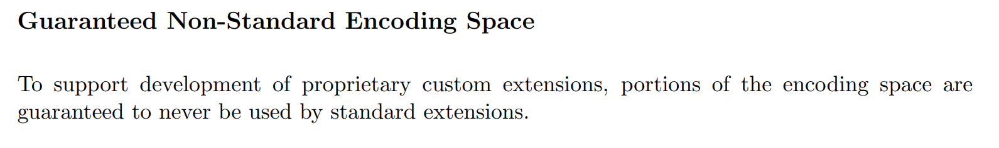

# <center>CSR相关指令介绍以及如何向sail-riscv中添加扩展简介
### <center>黄烁
#### <center>2024-4-3

---

# 目录
- [CSR相关介绍](#csr相关介绍)
- [熟知RISC-V spec中相关部分](##熟知RISC-V规范的相关部分)
- [尝试自定义指令](##尝试自定义指令)
- [指令测试](##指令测试)

---

# <center>CSR相关介绍

---

## CSR简介
在RISC-V Zicsr扩展中讲到，RISC-V 定义了与每个 hart 相关的 4096 个控制和状态寄存器(csr)的单独地址空间。而CSR（Control and Status Register，控制与状态寄存器）具有以下主要用途：

- 配置和控制：CSR包含一系列寄存器，用于控制和配置处理器的各个方面，例如中断使能、时钟设置、异常处理等。
- 中断管理：CSR中的一些寄存器用于管理中断，包括中断开关、中断入口等信息。
- 存储器保护：CSR允许设置不同地址空间的存储器的访问属性，例如可读、可写、可执行等。
- 性能统计和调试接口：CSR中的某些字段用于性能统计，以及与调试器通信的接口。

这些CSR在不同特权级别下具有不同的访问权限，用于控制处理器的行为和状态。

---

## CSR 字段定义

- 写时保护保留值，读时忽略值（WPRI, Reserved Writes Preserve Values, Reads Ignore Values）

  某些可读写的完整字段是保留给将来使用的。为前向兼容，软件应忽略所读取的值，并在向同一寄存器其它字段写入值时保留这些字段中的值。

- 只读写合法值（WLRL, Write/Read Only Legal Values）

  某些可读写的CSR字段（read/write CSR fields）仅定义了其部分可行二进制编码的行为。除合法值外，软件不应向此类字段写入任何其它内容，也不应假设读取能返回合法值，除非最后一次写入的是合法值

- 写任意值，读合法值（WARL, Write Any Values, Reads Legal Values）

  某些可读写CSR字段仅定义了其二进制编码的部分，但允许写入任何值，且同时保证读取时将返回合法值。假设在所写入的CSR在写入时没其它副作用，则可通过尝试写入预期的配置值然后读取并查看值是否被保留，来确定其所支持的值范围。


---

## 熟知RISC-V规范的相关部分

在我们进入如何自定义扩展之前，我们需要浏览 RISC-V 规范的相关部分，看看规范对添加指令有何规定。

根据非特权规范的第 26 章（“扩展 RISC-V”）描述了如何扩展 RISC-V 指令集。其中存在一条信息如下：




意思是为了支持专有自定义扩展的开发，保证部分编码空间永远不会被标准扩展使用。而这部分的编码空间就是我们想要添加指令的对应编码空间。

---

### 编码空间体现

而具体的编码可在第24章的编码规则中找到：


可看到RISC-V指令的类型由指令的第2-6位（从0开始计数）决定。而其中custom0与custom1便是上述所说保证不被标准占用的情况。

---

### 扩展命名规范

为保证规范性，RISC-V spec 中同样规定了非标准扩展的命名规则，如27章中所述：


其扩展应以大写X开头为命名，代表非标准扩展。

---

非特权规范对于自定义的说法大致如上，而CSR编码中同样存在可供扩展的部分,而如要对CSR寄存器进行对应的扩展，我们需要了解RISC-V的特权规范，其中第二章介绍了一张关于CSR寄存器的总表：


其中可看到对应custom字段以及其对应的编码空间。以及其属于什么类型，具有何权限等

---

## 尝试自定义指令

### 指令说明

这里我们先对需要定义的指令进行说明，我们将定义一个简单的指令，其接受一个立即数,进行0扩展后将其写入自定义CSR寄存器中，其他CSR读指令可以读取该指令，但其他CSR写指令无法写入该寄存器。对应如下说明：

- 指令：xmpl

- CSR寄存器： xmpl_csr

---

### 代码修改以及创建

在sail-riscv中创建如下代码：

- model/riscv_insts_custom_xmpl.sail：指令的具体定义以及实现
```
union clause ast = XTYPE : (bits(25), xop)
mapping encdec_x_xmpl : xop <-> bits(7) = {
  RISCV_X_XMPL <-> 0b0101011 // inst[6:5] == 01, inst[4:2] == 010 --> custom-0
}
mapping clause encdec = XTYPE(imm, xop)
  <-> imm @ encdec_x_xmpl(xop)
function clause execute (XTYPE(imm, xop)) = {
  let csr_val : bitvector(25, dec) = imm;
  xmpl_csr_2->FieldWARL() = csr_val ;
  RETIRE_SUCCESS
}
mapping x_xmpl_mnemonic : xop <-> string = {
  RISCV_X_XMPL <-> "x.xmpl"
}
mapping clause assembly = XTYPE(imm, xop)
  <-> x_xmpl_mnemonic(xop) ^ " " ^ hex_bits_25(imm)
```

---
- model/riscv_types.sail: 添加自定义指令的对应类型

```
enum xop = {RISCV_X_XMPL}
```

- Makefile：添加编译时需要添加的sail文件

```
SAIL_DEFAULT_INST += riscv_insts_custom_xmpl.sail
```

- model/riscv_csr_map.sail：添加自定义CSR寄存器的编码
```
mapping clause csr_name_map = 0xFC0 <-> "xmpl_csr" 
```

- model/riscv_sys_regs.sail: 添加自定义CSR寄存器的定义
```
register xmpl_csr:xlenbits
```


---

- model/iscv_insts_zicsr.sail:添加通用的CSR读函数
```
function readCSR csr : csreg -> xlenbits = {
  let res : xlenbits =
  match (csr, sizeof(xlen)) {
  .
  .
  /* machine mode, custom extension example */
  (0xFC0, _) => xmpl_csr, 
  .
  .
``` 

---

- model/riscv_sys_control.sail:添加CSR生效的条件，同时声明该CSR属于那种特权条件
```
function is_CSR_defined( csr : csreg, p : Privilege) -> bool =
.
.
  /* custom CSRs */
  0xFC0 => p == Machine, 
.
.
```

---

添加完毕后，重新编译即可。
```
make ARCH=RV32 csim
```

---

### 指令测试

编译完成后，由于编译器并不认识我们新添加的指令以及寄存器，我们不能如正常一般编写对应汇编程序来进行测试。因此我们采用如下方案：
- test.S:
```
.
.
#define X_XMPL_OPCODE   (0x2b)    // inst[6:5] == 01, inst[4:2] == 1011  -->  custom-0
#define X_XMPL(__imm__)  .word (__imm__ << 7)  | (X_XMPL_OPCODE << 0)
.
.
#define XMPL_CSR    (0xfc0)
.
.
the_test_begin:
  X_XMPL(0x0dead)
  csrr  x3, XMPL_CSR
.
.
```
---
可在编译完成后查看test.dump的具体情况：
```
80000054 <the_test_begin>:
80000054:	006f56ab          	.insn	4, 0x006f56ab
80000058:	fc0021f3          	csrr	gp,0xfc0
```

---

编译完成后使用对应编写的程序test.S进行测试：可得到如下结果：

```
.
.
mem[X,0x80000054] -> 0x56AB
mem[X,0x80000056] -> 0x006F
[42] [M]: 0x80000054 (0x006F56AB) x.xmpl 0xdead
mem[X,0x80000058] -> 0x21F3
mem[X,0x8000005A] -> 0xFC00
[43] [M]: 0x80000058 (0xFC0021F3) csrrs gp, xmpl_csr, zero
CSR xmpl_csr -> 0x0000DEAD
x3 <- 0x0000DEAD
.
.
SUCCESS
```

---

# <center>感谢