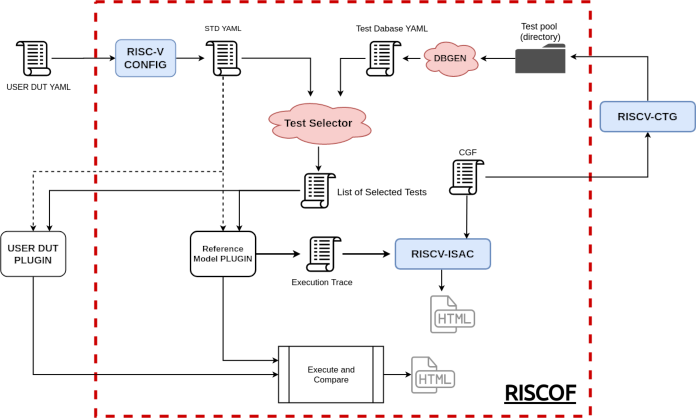

# 基于RISCOF谈谈SAIL对ISA测试的作用

---

## 目录

- ISA的概念，分类，设计，实现以及测试
- SAIL简介及SAIL-RISCV介绍
- RISCOF简介
- 三者间关系联系    
- SAIL-RISCV的环境搭建
- RISCOF环境搭建运行演示
- 测试样例来源
- 总结及展望

---

## ISA的概念，分类，设计，实现以及测试

### ISA的概念，分类，设计以及实现

- ISA是指令集架构的缩写，它是计算机抽象模型的一部分，定义了软件如何控制CPU，并且规定了计算机执行什么操作。ISA充当硬件和软件之间的接口，提供了用户能够与硬件交互的唯一方式

- ISA的分类有很多种，按照指令结构，数量，复杂度分为RISC和CISC，我们RISC-V便是RISC指令集的一种实现

- ISA的设计需要注意指令系统的完整性，兼容性，高效率和规整性; 一种规范描述ISA行为的语言便是SAIL

- ISA的实现是指将ISA的定义转化为具体的硬件电路的过程。设计芯片时，更重要的是各个指标的权衡。包括：功率、性能、成本、可靠性、安全性等

---

### ISA的验证测试

- ISA的测试：ISA的测试是指验证ISA的正确性和性能的过程，通常包括两个方面：功能测试和性能测试。

    - 功能测试是指检查ISA是否能正确地执行预期的操作，没有逻辑错误或者异常情况。

    - 性能测试是指评估ISA的运行效率，包括指令的执行时间、吞吐量、延迟等指标。ISA的测试可以通过软件模拟器或者硬件验证接口来进行。

---

## SAIL简介以及SAIL-RISCV介绍

Sail是一种用于描述处理器的指令集架构（ISA）语义的语言，它可以生成文档、可执行模拟器、定理证明器定义以及并发语义工具的定义。sail-riscv是一个用Sail语言编写的RISC-V架构的形式化规范。sail-riscv已经被RISC-V基金会采纳为它们的正式ISA规范，并且覆盖了RISC-V的不同扩展和特权模式。sail-riscv还提供了一个阅读指南，介绍了模型的结构和扩展方法。

---

## RISCOF项目简介

RISCOF是RISC-V架构测试框架的缩写，它是一种用于验证RISC-V实现是否符合RISC-V规范的工具。RISCOF使用RISCV-CONFIG来选择和配置测试，目前覆盖了RV[32|64]IMCFD_Zb*_zK*_Zmmul_Zicsr_Zifencei等多种扩展。同时在验证ISA实现中使用sail作为参照的Golden model 。RISCOF的目标是提高测试的可重用性、可移植性和可扩展性，以适应RISC-V生态系统的多样性和快速发展。

---

## 三者联系

- 如下图：

    

---

## SAIL-RISCV的环境搭建

在了解三者之间关系后，我们首先开始搭建SAIL-RISCV的模拟运行环境。这里使用的是Archlinux

---


## SAIL-RISCV的环境搭建

### 环境准备

- 安装opam,以及对应编译依赖：

    ```
    sudo pacman -S opam zlib pkgconf gmp z3
    ```

    注： opam要求版本为4.08.1及以上，若软件仓库中版本过低，可使用`opam switch`进行更新

    ```
    opam switch create 5.1.0
    ```

---

- 配置ocaml运行环境：

    ```
    eval $(opam config env)
    ```

- 安装sail编译器

    ```
    opam install sail
    ```

    安装完成后可查看sail版本验证是否配置正常：
    
    ```
    which sail
    sail --help
    ```

---


## SAIL-RISCV的环境搭建

### 编译，测试

- 下载源码：

    ```
    git clone https://github.com/riscv/sail-riscv.git
    ```

---

### 编译，测试

- 编译，测试：

    进入目录后，可以看到有对应脚本`build_simulators.sh`，执行并等待编译完成后便可看到对应文件夹中存在对应32位及64位的模拟器，也可运行test文件夹中的run_tests.sh,将会自动进行编译并使用test中的对应测试例（本为CI所用）确定编译结果是否正确
    
    ```
    ./build_simulators.sh
    # 执行完成后
    ls -l c_emulator/ | grep RV
    -rwxr-xr-x 1 minami minami 14544048 Nov  3 08:08 riscv_sim_RV32
    -rwxr-xr-x 1 minami minami 14797616 Nov  3 08:11 riscv_sim_RV64
    ```
    安装验证完毕后可通过修改PATH等方式将模拟器加入环境变量，方便后续RISCOF调用

---

## RISCOF环境搭建测试

### riscof安装

- 安装pyhton或安装python虚拟环境：

    由于考虑到环境的隔离，这里选择使用conda进行python虚拟环境的搭建

    ```
    # 安装conda
    yay -S python-conda

    # 创建虚拟环境
    conda create --name pyenp

    # 激活虚拟环境
    conda activate pyenv
    ```

---

- 安装riscof：
    
    考虑到后续套件更新以及开发调试修改，这里添加editable参数
    ```
    git clone https://github.com/riscv/riscof.git

    cd riscof
    pip3 install --editable .
    ```

---

### 其他组件配置安装

- 安装riscv-gnu-toolchain
    
    使用riscv-gnu-toolchain中对应工具将测试例中编写的汇编测试例编译为对应的elf
    ```
    sudo pacman -Syyu autoconf automake curl python3 libmpc mpfr gmp \
                      gawk base-devel bison flex texinfo gperf libtool\
                      patchutils bc zlib expat
    
    git clone --recursive https://github.com/riscv/riscv-gnu-toolchain
    
    git clone --recursive https://github.com/riscv/riscv-opcodes.git
    
    cd riscv-gnu-toolchain
    
    ./configure --prefix=/path/to/install 
    
    make 
    ```
    同样需要将/path/to/install/bin加入PATH环境变量

---

- 安装riscv-isa-sim（spike）

    这里使用spike作为被测试的模拟器，sail作为结果参照的模拟器
    ```
    sudo pacman -S dtc

    git clone https://github.com/riscv-software-src/riscv-isa-sim.git

    cd riscv-isa-sim && mkdir build && cd build

    ../configure --prefix=/path/to/install

    make

    make install 
    ```
    同样需要将/path/to/install/bin加入PATH环境变量

---

## 执行测试样例

- 初始化配置文件

    使用setup命令进行初始化，dutname表示测试目标;
    ```
    riscof setup --dutname=spike
    ```
    这将会在当前目录下生成一个config.ini文件，和两个目录：
    ```
    ├──config.ini                  
    ├──spike/                      
        ├── env/
        ├── riscof_spike.py         
        ├── spike_isa.yaml           #这两个yaml文件默认记载的为RV32的测试配置
        └── spike_platform.yaml      #如需要可进行更改
    ├──sail_cSim/                   
        ├── env
        ├── __init__.py
        └── riscof_sail_cSim.py     
    ```

---
- 修改配置文件
    修改spike文件夹中spike_isa.yaml和spike_platform.yaml文件，修改为目标为RV64的配置
    ```
    # spkie_isa.yaml 内容
    hart_ids: [0]
    hart0:
      ISA: RV64IMCZicsr_Zifencei
      physical_addr_sz: 56
      User_Spec_Version: '2.3'
      supported_xlen: [64]
    # spike_platform.yaml 内容
    mtime:
      implemented: true
      address: 0xbff8
    mtimecmp:
      implemented: true
      address: 0x4000
    nmi:
      label: nmi_vector
    reset:
      label: reset_vector
    ```
---

- 从RISCV-ARCH-TEST 中 clone 测试用例
    这里使用官方仓库已经合并的测试用例
    ```
    riscof --verbose info arch-tests --clone
    ```
    clone 完成后，将在当前目录下生成一个riscv-arch-tests目录，其中为官方github上的测试用例

- 运行测试用例
   输入命令运行测试并进行分析，测试报告会以html的形式呈现并自动使用浏览器或其他html阅读器打开
    ```
    riscof run --config=config.ini \
               --suite=riscv-arch-test/riscv-test-suite/ \
               --env=riscv-arch-test/riscv-test-suite/env
    ```
---

## 测试样例的来源

- 鉴于ISA测试需要测试大量的指令以及寄存器组合，故手动编写测试例对测试ISA的完备性来说不够高效，故官方对应框架使用了RISCV-CTG项目进行自动测试例生成
- 下面简单介绍一下RISCV-CTG，具体生成的测试例样式以及后续测试开发的潜在可能

---

### RISCV-CTG

- 由RISCV-CTG生成的测试用例为汇编文件，其主要结构如下：

```
#include "model_test.h"
#include "arch_test.h"
RVTEST_ISA("RV32IA")

inst_0:
// rs1 != rs2  and rs1 != rd and rs2 != rd, rs1==x31, rs2==x29, 
// rd==x30, rs2_val == (-2**(xlen-1)), rs2_val == -2147483648
// opcode: amoadd.w ; op1:x31; op2:x29; dest:x30; 
// op1val:0xf7ffffff;  op2val:-0x80000000
TEST_AMO_OP(amoadd.w, x30, x31, x29, 0xf7ffffff, -0x80000000, x1, 0*XLEN/8)

```
可以看出其将对应的指令以及寄存器以及寄存器中值构成的组合作为函数参数传入事先设计好的函数中，而从执行log可看出对应每次执行的测试指令组合

---

