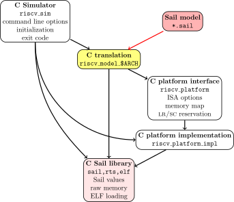

# <center> Sail 语言 C 后端的异常处理机制

### <center>黄烁
### <center>2024-7-10

---

## Sail C语言后端简介



---

## 目前 Sail-RISC-V 翻译解释 C 语言后的异常处理机制

目前 sail-riscv 项目下 C 语言的异常处理流程为，每个对应的函数通过控制全局变量`have_exception`来指示对应的操作，然后外层调用此函数的其余代码块会检查变量是否存在变化，从而将异常提示信息逐层上传，最后上传到主函数执行流，从而进行主函数的终止操作

```
    struct zexception zgaz31963;
    CREATE(zexception)(&zgaz31963);
    zError_not_implemented(&zgaz31963, "store.aq");
    COPY(zexception)(current_exception, zgaz31963);
    have_exception = true;
    COPY(sail_string)(throw_location, "model/riscv_mem.sail:62.29-62.69");
    KILL(zexception)(&zgaz31963);
    goto end_block_exception_2868;
    /* unreachable after throw */
    KILL(zexception)(&zgaz31963);
    goto finish_match_2858;
```
---
上层函数调用：
```
  unit zgaz32010;
  {
      enum zwrite_kind zgaz32009;
      {
      zgaz32009 = zwrite_kind_of_flags(zaq, zrl, zcon);
      if (have_exception) {
  
  
  
          goto end_block_exception_2914;
      }
      }
      zgaz32010 = zwrite_ram_ea(zgaz32009, zaddr, zwidth);
  }
```

---

主函数执行时检测是否错误的部分：
```
  if (have_exception) {
    fprintf(stderr, "Exiting due to uncaught exception: %s\n", *throw_location);
  }
  KILL(zexception)(current_exception);
  sail_free(current_exception);
  KILL(sail_string)(throw_location);
  sail_free(throw_location);
  if (have_exception) {
    exit(EXIT_FAILURE);
  }
```

---

## Sail 源码中对 .sail 到 .c 的翻译转换

在sail中，我们知道一般会使用`try...catch...`语句以及`throw`语句进行异常的定义以及捕捉，

sail-riscv/model/riscv_mem.sail:53-64
```
function write_kind_of_flags (aq : bool, rl : bool, con : bool) -> write_kind =
  match (aq, rl, con) {
    (false, false, false) => Write_plain,
    (false, true,  false) => Write_RISCV_release,
    (false, false, true)  => Write_RISCV_conditional,
    (false, true , true)  => Write_RISCV_conditional_release,
    (true,  true,  false) => Write_RISCV_strong_release,
    (true,  true , true)  => Write_RISCV_conditional_strong_release,
    // throw an illegal instruction here?
    (true,  false, false) => throw(Error_not_implemented("store.aq")),
    (true,  false, true)  => throw(Error_not_implemented("sc.aq"))
  }
```

---

sail-riscv/model/main.sail:26-41
```
function main() : unit -> unit = {
  // initialize extensions
  ext_init();

  PC = get_entry_point();
  print_bits("PC = ", PC);

  try {
    init_model();
    sail_end_cycle();
    loop()
  } catch {
    Error_not_implemented(s) => print_string("Error: Not implemented: ", s),
    Error_internal_error() => print("Error: internal error")
  }
}
```
---

## sail 源码中转化为 C 代码的模块的主要执行代码

在 sail 中，其将 sail 代码转化为 C 代码首先便是使用其 api 将初步解析出来的语法定义转换为 C 代码，然后输出到定义文件中

sail/src/sail_c_backend/sail_plugin_c.ml:162-169
```ocaml
let c_target out_file { ast; effect_info; env; _ } =
  let close, output_chan = match out_file with Some f -> (true, open_out (f ^ ".c")) | None -> (false, stdout) in
  Reporting.opt_warnings := true;
  C_backend.compile_ast env effect_info output_chan !opt_includes_c ast;
  flush output_chan;
  if close then close_out output_chan

let _ = Target.register ~name:"c" ~options:c_options ~rewrites:c_rewrites c_target

```

---

而更进一步的，其会使用Jib_comple相关的语法解析去解析对应的上下文：
```ocaml
let compile_ast env effect_info output_chan c_includes ast =
  try
    let cdefs, ctx = jib_of_ast env effect_info ast in
...
```
```ocaml
let jib_of_ast env effect_info ast =
  let module Jibc = Make (C_config (struct
    let branch_coverage = !opt_branch_coverage
  end)) in
  let env, effect_info = add_special_functions env effect_info in
  let ctx = initial_ctx env effect_info in
  Jibc.compile_ast ctx ast
```

---

## sail 中对异常抛出 throw 的相关语法定义

sail/language/sail.ott:468-532

```
exp :: 'E_' ::=
  {{ com expression }}
  {{ aux _ annot }} {{ auxparam 'a }}
  | { exp1 ; ... ; expn }                               :: :: block
  ...
  | throw exp                                         :: :: throw
  ...
```


---

## sail c_backend.ml 中关于异常初始化处理的定义

sail/src/sail_c_backend/c_backend.ml:2116-2134
```ocaml
let exn_boilerplate =
  if not (Bindings.mem (mk_id "exception") ctx.variants) then ([], [])
  else
    ( [
        "  current_exception = sail_new(struct zexception);";
        "  CREATE(zexception)(current_exception);";
        "  throw_location = sail_new(sail_string);";
        "  CREATE(sail_string)(throw_location);";
      ],
      [
        "  if (have_exception) {fprintf(stderr, \"Exiting due to uncaught exception: %s\\n\", *throw_location);}";
        "  KILL(zexception)(current_exception);";
        "  sail_free(current_exception);";
        "  KILL(sail_string)(throw_location);";
        "  sail_free(throw_location);";
        "  if (have_exception) {exit(EXIT_FAILURE);}";
      ]
    )
in
```

---

## sail 中对 throw 这一语法相对应解析的对应补充逻辑

在 complie_ast 中，sail 会遍历 ast.defs 列表中的每个定义，对每个定义进行编译操作（通过 compile_def 函数），并将编译后的结果存储在 cdefs 中。

```ocaml
let total = List.length ast.defs in
    let _, chunks, ctx =
      List.fold_left
        (fun (n, chunks, ctx) def ->
          let defs, ctx = compile_def n total ctx def in
          (n + 1, defs :: chunks, ctx)
        )
        (1, [], ctx) ast.defs
    in
    let cdefs = List.concat (List.rev chunks) in
```

---

而在`compile_def`函数中，sail 会将 sail 语言中的不同类型的定义转换为对应的 C 语言结构体或函数，并根据需要处理缓存、处理函数定义的多种模式匹配情况，以及处理各种类型的声明和约束。这些函数通过递归和模式匹配实现了对复杂结构的处理和转换。其中对于函数的定义使用了`compile_funcl`函数

```ocaml
  let rec compile_def n total ctx (DEF_aux (aux, _) as def) =
    match aux with
    ...
  and compile_def' n total ctx (DEF_aux (aux, def_annot) as def) =
    let def_env = def_annot.env in
    let def_annot = strip_def_annot def_annot in
    match aux with
    ...
    | DEF_fundef (FD_aux (FD_function (_, _, [FCL_aux (FCL_funcl (id, Pat_aux (Pat_exp (pat, exp), _)), _)]), _)) ->
        Util.progress "Compiling " (string_of_id id) n total;
        compile_funcl ctx def_annot id pat None exp
    | DEF_fundef (FD_aux (FD_function (_, _, [FCL_aux (FCL_funcl (id, Pat_aux (Pat_when (pat, guard, exp), _)), _)]), _))
      ->
        Util.progress "Compiling " (string_of_id id) n total;
        compile_funcl ctx def_annot id pat (Some guard) exp
    ...
```

---

该函数实现了将 sail 语言中的函数定义编译为目标代码（IR 指令序列）的过程。它涉及了函数类型的查找、参数模式的处理、条件 guard 的处理、表达式的优化和编译，异常和覆盖的修复，以及调试信息的输出。而其中的`fix_exception`包含了其对于函数具体逻辑的解释

```ocaml
  let compile_funcl ctx def_annot id pat guard exp =
    let debug_attr = get_def_attribute "jib_debug" def_annot in
    ...
    let instrs =
      arg_setup @ destructure @ guard_instrs @ setup
      @ [call (CL_id (return, ret_ctyp))]
      @ cleanup @ destructure_cleanup @ arg_cleanup
    in
    let instrs = fix_early_return (exp_loc exp) (CL_id (return, ret_ctyp)) instrs in
    let instrs = unique_names instrs in
    let instrs = fix_exception ~return:(Some ret_ctyp) ctx instrs in
    let instrs = coverage_function_entry ctx id (exp_loc exp) @ instrs in
    ...
```

---

对于该函数，其调用对应`fix_exception_block`函数对对应代码块进行解析，并将其与指令块进行映射，而在`fix_exception_block`函数中，其定义了`rewrite_exception`函数，其根据特定的代码块对异常进行处理

```ocaml
    let rec rewrite_exception historic instrs =
      match instr_split_at is_exception_stop instrs with
      ...
      | before, I_aux (I_throw cval, (_, l)) :: after ->
          before
          @ [
              icopy l (CL_id (current_exception, cval_ctyp cval)) cval;
              icopy l (CL_id (have_exception, CT_bool)) (V_lit (VL_bool true, CT_bool));
            ]
          @ ( if C.track_throw then (
                let loc_string = Reporting.short_loc_to_string l in
                [icopy l (CL_id (throw_location, CT_string)) (V_lit (VL_string loc_string, CT_string))]
              )
              else []
            )
          @ generate_cleanup (historic @ before)
          @ [igoto end_block_label]
          @ rewrite_exception (historic @ before) after
      ...
```
而对应的逻辑我们同样可在编译出来的代码中看到

---

## sail ocaml 后端对应 throw 处理

由于sail使用ocaml库编写，其自然包含ocaml的一些基本函数库，故其在throw的处理上显得比起C语言来说更加得心应手
sail-riscv/generated_definitions/ocaml/RV32/riscv.ml:16648-16667
```ocaml
and zwrite_kind_of_flags ((zaq, zrl, zcon) : (bool * bool * bool)) : zwrite_kind = sail_call (fun r ->
  begin
    match (zaq, zrl, zcon) with
    ...
    | (zp0z3, zp1z3, zp2z3) when (((eq_bool (zp2z3, false)) && (eq_bool (zp1z3, false))) && (eq_bool (zp0z3, true))) ->
      raise (ZError_not_implemented "store.aq")
    | (zp0z3, zp1z3, zp2z3) when (((eq_bool (zp2z3, true)) && (eq_bool (zp1z3, false))) && (eq_bool (zp0z3, true))) ->
      raise (ZError_not_implemented "sc.aq")
  end)
```
sail/src/sail_ocaml_backend/ocaml_backend.ml:260-387
```ocaml
let rec ocaml_exp ctx (E_aux (exp_aux, (l, _)) as exp) =
  match exp_aux with
  ...
  | E_throw exp -> string "raise" ^^ space ^^ ocaml_atomic_exp ctx exp
  ...
```

---

# 总结

本次技术分享我们从 sail 编译出来的 C 后端中的代码块开始，逐步从源码到语义的解析翻译分析 sail 将 sail 源码翻译为 C 语言代码的具体过程，同时我们可以看到对应的 throw 语句要翻译为 C 代码所经历的处理方式。

从中可看出 C 语言后端与 OCaml 后端之间的区别，也为其进行可能的功能完善有一定帮助

---

# <center> 感谢


