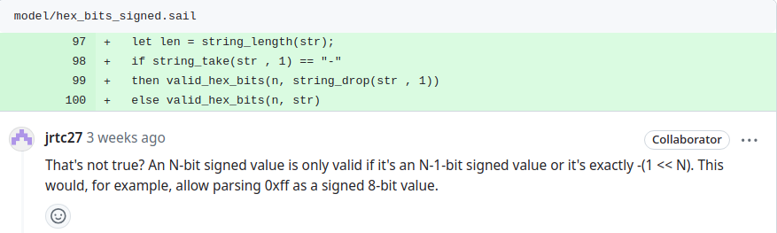

# <center>Sail 关于 hex_str 函数的不安全 bug 分析
### <center> 黄烁
#### <center> 2024-4-29

---

## Bug 发现

在向sail-riscv提交pr的review中，发现代码中存在关于hex_str函数的引用存在潜在bug：
  <p align="center">
    
  </p>
但另一方面，在sail-riscv原来的代码中，此情况同样存在。

即在引用sail的hex_str时，在将str字符串转为对应的数值时，sail缺失了对于传入参数的检查，导致可能出现传入的字符串对应数值溢出的情况。

---

## hex_str 原理库分析

在sail中，我们在将对应的数值转换为十六进制字符串时一般使用的格式如：

```
let foo：string = hex_bits_8(0x0F)
```


而对应的函数 `hex_bits_n()` 实际上是库函数 `hex_bits()` 的包装，其定义一个双射，将数值与字符串相映射，其签名中的n对应的就是传入参数中的数值长度 `n` ：

```
mapping hex_bits_1 : bits(1) <-> string = { hex_bits(1, s) <-> s }
mapping hex_bits_2 : bits(2) <-> string = { hex_bits(2, s) <-> s }
mapping hex_bits_3 : bits(3) <-> string = { hex_bits(3, s) <-> s }
...
mapping hex_bits_31 : bits(31) <-> string = { hex_bits(31, s) <-> s }
mapping hex_bits_32 : bits(32) <-> string = { hex_bits(32, s) <-> s }
```

---

而函数 `hex_bits()` 对应另一个双射，其将数值与元组进行映射,其中元组包含数值长度以及字符串，其签名如下：

```
val hex_bits : forall 'n, 'n > 0. bits('n) <-> (int('n), string)
```

而此函数的具体实现需要较多的逻辑，由于为双射，故包括forwards与backwards部分，其中forwards函数将数值转为对应信息的元组，由于其将对应二进制串以unsigned处理为无符号数值，且转变为某个无符号数值后其总能转为对应的十六进制字符串，其并没有什么问题，故检查合法性的函数被赋值为true，不进行检查：

```
function hex_bits_forwards(bv) = (length(bv), hex_str(unsigned(bv)))
function hex_bits_forwards_matches(bv) = true
```

---

另一方面，backwards函数将元组转为对应的数值，其将对应的十六进制字符串转为对应的二进制串，由于其将对应的十六进制字符串一位位转变回对应数值，而指定的str存在非法值（即存在非十六进制字符串的情况），故其并不能够保证对应的数值能够被二进制串表示，故检查合法性的函数被赋值为库函数 `valid_hex_bits`，需要检查：

```
function hex_bits_backwards(n, str) = parse_hex_bits(n, str)
function hex_bits_backwards_matches(n, str) = valid_hex_bits(n, str)
```

---

## Bug分析

而上述bug的原因，追根溯源就出现在库函数 `valid_hex_bits` 以及 `parse_hex_bits` 中，其C语言后端如下：

```C
bool valid_hex_bits(const mpz_t n, const_sail_string hex) {
  if (strncmp(hex, "0x", 2) != 0) {
    return false;
  }

  for (int i = 2; i < strlen(hex); i++) {
    char c = hex[i];
    if (!((c >= '0' && c <= '9') || (c >= 'a' && c <= 'f') || (c >= 'A' && c <= 'F'))) {
      return false;
    }
  }

  return true;
}
```
---


其中可看到 `valid_hex_bits` 函数只对字符串`hex`是否为十六进制字符串进行检查，而并没有对`hex`是否与其对应的n数值长度相匹配进行检查，故其可能出现溢出的情况。如`valid_hex_bits(3, "0xF")` 在此逻辑中为真，而同样的ocaml后端同理:

```ocaml
let valid_hex_bits (_, s) =
  let len = String.length s in
  (* We must have at least the 0x prefix, then one character *)
  if len < 3 || String.sub s 0 2 <> "0x" then false
  else (
    let hex = String.sub s 2 (len - 2) in
    let is_valid = ref true in
    String.iter (fun c -> is_valid := !is_valid && is_hex_char c) hex;
    !is_valid
  )
```
---

而另一方面，作为位数标志的n在实现的时候，在验证合法性时被忽略，只有在检查时发现转化的字符串存在错误，即不符合十六进制字符串的定义时，作为错误处理的指示，生成一个n位的全零码:
```ocaml
let parse_hex_bits (n, s) =
  if not (valid_hex_bits (n, s)) then zeros n
  else bits_of_string (String.sub s 2 (String.length s - 2)) 
    |> List.rev 
    |> Util.take (Big_int.to_int n) 
    |> List.rev
```

---

C后端甚至只检验了字符串是否以“0x”开头：
```C
void parse_hex_bits(lbits *res, const mpz_t n, const_sail_string hex)
{
  if (strncmp(hex, "0x", 2) != 0) {
    goto failure;
  }

  mpz_t value;
  mpz_init(value);
  if (mpz_set_str(value, hex + 2, 16) == 0) {
    res->len = mpz_get_ui(n);
    mpz_set(*res->bits, value);
    mpz_clear(value);
    return;
  }
  mpz_clear(value);

  // On failure, we return a zero bitvector of the correct width
failure:
  res->len = mpz_get_ui(n);
  mpz_set_ui(*res->bits, 0);
}
```

---

## Bug修复

而修复此bug，只需要在 `valid_hex_bits` 函数中添加对`hex`是否与其对应的n数值长度相匹配的检查，同时使得 `parse_hex_bits` 函数受 `valid_hex_bits`的检验即可。

---

## 初步修复方案：sail代码

```ocaml
function valid_char_hex_bits_signed(n, str) = {
  match str {
    "0" => true,
    "1" => n > 1,
    "2" => n > 2,
    "3" => n > 2,
    "4" => n > 3,
    "5" => n > 3,
    "6" => n > 3,
    "7" => n > 3,
    _ => false
  }
}
```
---

```ocaml
function valid_hex_bits_signed(n, str) = {
  let str_ = if   string_take(str, 1) == "-"
             then string_drop(str, 1)
             else str;
  let len = string_length(str_);
  if len > 3
  then {
    let upper = n - ((len - 3) * 4);
    if upper > 0 & upper < 5
    then {
      let str_2 = string_take(string_drop(str_, 2), 1);
      if valid_char_hex_bits_signed(upper, str_2)
      then valid_hex_bits(n, str_)
      else false
    }
    else false
  }
  else false
}
```

---

## 进一步意见：上游修改
```C
void parse_hex_bits(lbits *res, const mpz_t n, const_sail_string hex)
{
  if (!valid_hex_bits(n, hex)) {
    goto failure;
  }

  mpz_t value;
  mpz_init(value);
  if (mpz_set_str(value, hex + 2, 16) == 0) {
    res->len = mpz_get_ui(n);
    mpz_set(*res->bits, value);
    mpz_clear(value);
    return;
  }
  mpz_clear(value);

  // On failure, we return a zero bitvector of the correct width
failure:
  res->len = mpz_get_ui(n);
  mpz_set_ui(*res->bits, 0);
}

```

---

```C
bool valid_hex_bits(const mpz_t n, const_sail_string hex) {
  ...
  size_t len = strlen(hex);
  // There must be at least one character after the '0x'
  if (len < 3) {
    return false;
  }
  // Ignore any leading zeros
  int non_zero = 2;
  while (hex[non_zero] == '0' && non_zero < len - 1) {
    non_zero++;
  }
  // Check how many bits we need for the first-non-zero (fnz) character.
  int fnz_width;
  char fnz = hex[non_zero];
  if (fnz == '0') {
    fnz_width = 0;
  } else if (fnz == '1') {
    fnz_width = 1;
  } else if (fnz >= '2' && fnz <= '3') {
    fnz_width = 2;
  } else if (fnz >= '4' && fnz <= '7') {
    fnz_width = 3;
  } else {
    fnz_width = 4;
  }
  // The width of the hex string is the width of the first non zero,
  // plus 4 times the remaining hex digits
  int hex_width = fnz_width + ((len - (non_zero + 1)) * 4);
  if (mpz_cmp_si(n, hex_width) < 0) {
    return false;
  }

  ...
}
```

---

```ocaml
let hex_char_width c =
  if c = '0' then 0
  else if c = '1' then 1
  else if c = '2' || c = '3' then 2
  else if c = '4' || c = '5' || c = '6' || c = '7' then 3
  else 4

let valid_hex_bits (n, s) =
  let len = String.length s in
  (* We must have at least the 0x prefix, then one character *)
  if len < 3 || String.sub s 0 2 <> "0x" then false
  else (
    let hex = String.sub s 2 (len - 2) in
    let is_valid = ref true in
    let actual_len = ref 0 in
    let seen_non_zero = ref false in
    String.iter
      (fun c ->
        if !seen_non_zero then actual_len := !actual_len + 4
        else if c <> '0' then (
          actual_len := !actual_len + hex_char_width c;
          seen_non_zero := true
        );
        is_valid := !is_valid && is_hex_char c
      )
      hex;
    !actual_len <= Big_int.to_int n && !is_valid
  )
```

---

## 目前影响

目前此bug对sail model的运行是没有影响的，因为实际上sail model在执行elf文件时，只是以elf的阅读方式读入对应的编码，然后使用`bits -> ast`的映射定位到对应的指令的ast, 执行ast对应的执行函数后，在将对应的指令转为string 打印到log 中，而对应的另一方面的映射可以说目前没有使用到，只有在使用sail将对应的项目里信息输出为JSON 时才体现出来，这也是目前来说sail上游并没有察觉到此函数存在问题的原因。但即使如此，也不能改变其实际上是一个逻辑上的bug的事实，此修改依然避免了之后可能产生的其他问题，同时也使sail模拟器运行更为严谨。

---

## 总结

本次分享，我们主要介绍了sail_hex_bug的产生原因，以及上游修改的思路，并简单介绍了目前sail模拟器运行时，此bug对模拟器运行的影响。

---

# <center> 感谢聆听
