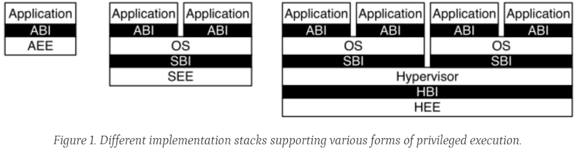
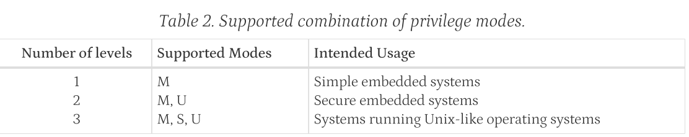

# <center> RISC-V ISA 级安全保护机制简析

### <center> 黄烁

### <center> 2024-8-14

---

## RISC-V 中特权模式简介

### RISC-V Privileged Software Stack

在RISC-V spec中，其声明了三种可能的软件栈模型



---

在 RISC-V 中,存在以下几种特权模式，在运行的任意时刻，每个RISC-V hart都运行在某种具体的特权模式下:

- 机器模式(Machine Mode, M-Mode):
    最高权限的特权模式,用于固件以及其他关键的系统软件。

- 监管模式(Supervisor Mode, S-Mode):
    次高权限的特权模式,用于运行操作系统内核。

- 用户模式(User Mode, U-Mode):
    最低权限的特权模式,用于运行普通的应用程序。


---

这些特权模式提供了一种分层的安全机制,允许操作系统内核和其他关键系统软件在更高特权级运行,同时将应用程序限制在更低特权级。这有助于提高系统的安全性和可靠性。

不同的特权模式之间可以进行切换,例如用户模式可以通过系统调用切换到监管模式或机器模式。特权模式的切换由硬件和软件共同完成,以确保安全性。

而对于硬件实现，一般要求至少实现M-mode, 然后是U-mode, 对于需要支持运行Unix-like的操作系统的硬件，就需实现三种mode



而作为RISC-V ISA 的golden model， Sail-RISCV自然实现此三种mode

另外，对于只实现了M-mode的硬件，pmp的锁机制也同样提供了M-mode下一定的对物理内存的保护

---

## RISC-V 中pmp机制

RISC-V 中的 PMP (Physical Memory Protection) 机制是一种用于控制对物理内存访问的保护机制。它的主要实现了:

- 内存访问控制

依靠对CSR $pmpaddr_i$ $pmpcfg_i$的配置，可以实现：

- 内存区域配置

- 特权级别访问控制

- 动态配置

---

### Sail中对pmp锁机制以及priv之间的实现

```ocaml
// this needs to be called with the effective current privilege.
val pmpCheckPerms: (Pmpcfg_ent, AccessType(ext_access_type), Privilege) -> bool
function pmpCheckPerms(ent, acc, priv) = {
  match priv {
    Machine => if   pmpLocked(ent)
               then pmpCheckRWX(ent, acc)
               else true,
    _       => pmpCheckRWX(ent, acc)
  }
}
```

---

## M-mode 到 S-mode 的切换

作为ISA的验证模拟器，自然少不了对各种mode下访问的验证，Sail模拟器初始化时设定的特权便是M-mode.

```ocaml
function init_sys() -> unit = {
  cur_privilege = Machine;

  mhartid     = zero_extend(0b0);
  mconfigptr  = zero_extend(0b0);
  ...
}
```

---
### Trap-Return Instructions

RISC-V spec中声明了如何从对应的trap退出并根据mstatus CSR中的配置去切换之后代码运行的特权等级的指令mret/sret

而如果需要进行特权模式的切换，我们就需要编写出对应的trap事件以及其处理行为，另外，spec中还声明了，在使用对应的xret(x=m/s)时，最后会读取xepc CSR中的地址并载入PC中


---

### trap切换的简单实现

```assembly

    li    t1, 0x1          // 0x3 对应 M-mode，设置 t1 的值为 3
    slli  t1, t1, 11       // 将 t1 左移 11 位，使其对齐 mstatus 寄存器中的 MPP 位
    csrs  mstatus, t1      // 将修改后的值写回 mstatus 寄存器

    // 跳转到用户模式代码（一般是通过 MRET 指令返回）
    csrr  t0, mepc         // 获取返回地址，通常是用户模式代码的起始地址
    mret                   // 从机器模式返回到指定的特权级别

```

---

### ACT 中提供的固定宏

如果是在使用ACT编写定制的框架下进行切换，其也提供了对应的的宏来从M-mode跳转到更低等级的privlege

```asm
.macro RVTEST_GOTO_LOWER_MODE LMODE
.option push
.option norvc
...
#else                           /* XLEN=64, maybe 128? FIXME for 128    */
  .if ((\LMODE\()==Smode) || (\LMODE\()==Umode)) /* lv V unchanged here  */
    LI(  T4,  MSTATUS_MPP)      /* but always clear PP                  */
  .else
    LI(  T4, (MSTATUS_MPP | MSTATUS_MPV))       /* clr V and P          */
  .endif
...
```
---

### 设置pmp后报错解析

- mret的实现

```ocaml
union clause ast = MRET : unit

mapping clause encdec = MRET()
  <-> 0b0011000 @ 0b00010 @ 0b00000 @ 0b000 @ 0b00000 @ 0b1110011

function clause execute MRET() = {
  if   cur_privilege != Machine
  then { handle_illegal(); RETIRE_FAIL }
  else if not(ext_check_xret_priv (Machine))
  then { ext_fail_xret_priv(); RETIRE_FAIL }
  else {
    set_next_pc(exception_handler(cur_privilege, CTL_MRET(), PC));
    RETIRE_SUCCESS
  }
}

mapping clause assembly = MRET() <-> "mret"
```
---
- exception_handler函数
```ocaml
function exception_handler(cur_priv : Privilege, ctl : ctl_result,
                           pc: xlenbits) -> xlenbits = {
  match (cur_priv, ctl) {
    ...
    (_, CTL_MRET())  => {
      let prev_priv   = cur_privilege;
      mstatus[MIE]  = mstatus[MPIE];
      mstatus[MPIE] = 0b1;
      cur_privilege   = privLevel_of_bits(mstatus[MPP]);
      mstatus[MPP]  = privLevel_to_bits(if extensionEnabled(Ext_U) then User else Machine);
      if   cur_privilege != Machine
      then mstatus[MPRV] = 0b0;

      if   get_config_print_reg()
      then print_reg("CSR mstatus <- " ^ BitStr(mstatus.bits));
      if   get_config_print_platform()
      then print_platform("ret-ing from " ^ to_str(prev_priv) ^ " to " ^ to_str(cur_privilege));

      prepare_xret_target(Machine) & pc_alignment_mask()
    },
    ...
  }
}
```

---

- prepare_xret_target函数

```ocaml
val get_xret_target : Privilege -> xlenbits
function get_xret_target(p) =
  match p {
    Machine    => mepc,
    Supervisor => sepc,
    User       => uepc
  }

...

val prepare_xret_target : (Privilege) -> xlenbits
function prepare_xret_target(p) =
  get_xret_target(p)

```

---

- step函数

```ocaml
function step(step_no : int) -> bool = {
  ...
  let (retired, stepped) : (Retired, bool) =
    match dispatchInterrupt(cur_privilege) {
      Some(intr, priv) => {
        ...
      },
      None() => {
        /* the extension hook interposes on the fetch result */
        match ext_fetch_hook(fetch()) {
          /* extension error */
          F_Ext_Error(e)   => {
            ...
          },
          /* standard error */
          F_Error(e, addr) => {
            ...
          },
          /* non-error cases: */
          F_RVC(h) => {
            ...
          },
          F_Base(w) => {
            ...
          }
        }
      }
    };
  ...
}
```
---

- fetch函数
```ocaml
function fetch() -> FetchResult =
  match ext_fetch_check_pc(PC, PC) {
    Ext_FetchAddr_Error(e)   => F_Ext_Error(e),
    Ext_FetchAddr_OK(use_pc) => {
      if   (use_pc[0] != bitzero | (use_pc[1] != bitzero & not(extensionEnabled(Ext_C))))
      then F_Error(E_Fetch_Addr_Align(), PC)
      else match translateAddr(use_pc, Execute()) {
        TR_Failure(e, _)     => F_Error(e, PC),
        TR_Address(ppclo, _) => {
          match mem_read(Execute(), ppclo, 2, false, false, false) {
            MemException(e) => F_Error(e, PC),
            ...
          }
        }
      }
    }
  }

```

---

### pmp相关CSR定义


---

### pmp地址范围界定方式

```ocaml
function pmpAddrRange(cfg: Pmpcfg_ent, pmpaddr: xlenbits, prev_pmpaddr: xlenbits) 
-> pmp_addr_range_in_words = {
  match pmpAddrMatchType_of_bits(cfg[A]) {
    OFF   => None(),
    TOR   => { Some ((prev_pmpaddr, pmpaddr)) },
    NA4   => {
               assert(sys_pmp_grain() < 1, "NA4 cannot be selected when PMP grain G >= 1.");
               let lo = pmpaddr;
               Some((lo, lo + 4))
             },
    NAPOT => {
               let mask = pmpaddr ^ (pmpaddr + 1);
               let lo   = pmpaddr & (~ (mask));
               let len  = mask + 1;
               Some((lo, (lo + len)))
             }
  }
}
```

---

# 总结

本次技术分享通过解读RISC-V中不同的特权级及其其切换，以及pmp物理内存保护，我们得知了RISC-V ISA级的安全保护机制，以及灵活的物理内存保护方式，通过分析SAIL中的对应实现，希望给大家带来一定收获。

---

# <center> 感谢
