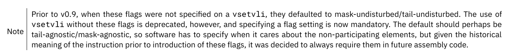

# Sail-RISCV 中关于 vsetvli 指令相关定义问题

## vsetvli 指令相关介绍

vsetvli 指令是 RISC-V 向量扩展的一部分，用于设置向量长度（vl）和向量类型（vtype）。这个指令决定了接下来的向量操作将会使用多少向量寄存器以及每个元素的大小。

具体来说，vsetvli 指令的格式如下：

```asm
vsetvli rd, rs1, vtypei # rd = new vl, rs1 = AVL, vtypei = new vtype setting
```
其中：
* rd（目的寄存器）：这个寄存器会被设置为新的向量长度 vl。
* rs1：包含应用向量长度（AVL），它指示了程序希望使用的向量长度。
* vtypei（立即数）：编码了向量类型 vtype，包括向量元素宽度（vsew）

vsetvli 指令会根据 AVL 以及VLMAX来设置 vl。

而关于imul，ta，ma寄存器相关的叙述：

目前的系统将会根据sew 和imul 的设定来决定当前数据在寄存器中的映射，而ta 与ma 寄存器中的值决定了如何处理在执行过程中目标向量的尾部元素和屏蔽元素的行为，其中关于ta，ma寄存器的设置明确有：



即在spec版本0.9之前，对于此寄存器的设置指令存在默认值，但到1.0版本后，使用vsetvli等指令设置时，需要声明对应对应的寄存器的值。

## sail 中关于此的定义

在sail中，关于此指令以及vsetivli 的ast 的执行部分是符合规范的，鉴于sail model 读取的是对应指令的机器码，其中关于寄存器的值必为固定，但问题可能会出现在反汇编显示部分：

```ocaml
mapping clause assembly = VSETVLI(ma, ta, sew, lmul, rs1, rd)
  <-> "vsetvli" ^ spc() ^ reg_name(rd) ^ sep() ^ reg_name(rs1) ^ sep() ^ sew_flag(sew) ^ maybe_lmul_flag(lmul) ^ maybe_ta_flag(ta) ^ maybe_ma_flag(ma)

```

其中maybe_ta_flag()与maybe_ma_flag()函数的函数体如下：
```ocaml
mapping maybe_ta_flag : string <-> bits(1) = {
  ""           <-> 0b0, /* tu by default */
  sep() ^ "ta" <-> 0b1,
  sep() ^ "tu" <-> 0b0
}

mapping maybe_ma_flag : string <-> bits(1) = {
  ""           <-> 0b0, /* mu by default */
  sep() ^ "ma" <-> 0b1,
  sep() ^ "mu" <-> 0b0
}
```
可看到其中依然预留了default的位置，这样会导致对于反汇编来说，他会优先匹配default的空值，而非下面的`tu`或`mu`值，导致如果对应设置为tu或mu，其输出一直为空，这可能导致编译和执行的信息丢失以及与1.0规范的不匹配。


