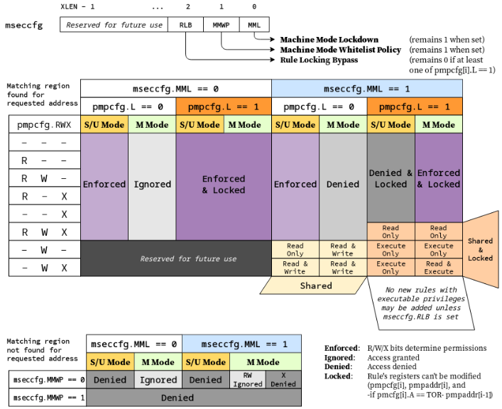

#  RISC-V smepmp扩展介绍以及Sail实现

### 黄烁 2024-10-23


---

##  SMEPMP扩展概述

### SMEPMP 全称为 PMP Enhancement for memory access and execution prevention on Machine mode, 是一个已获得RISC-V社区批准的安全扩展。
 - 设计动机
SMEPMP的设计目的是为了在M-mode（机器模式）下提供对内存访问和执行的防护机制，特别是针对那些只有U/M-mode（用户模式/机器模式）但没有S-mode（监管模式）的嵌入式设备。
 - 作用：提供额外的内存保护机制

---

### 目前扩展攻击向量的存在（安全隐患）

   从低权限模式（如用户模式）访问运行在高权限执行模式（如监控器或机器模式）下的进程的内存，会引入一个明显的攻击向量，因为它允许攻击者执行权限升级，并篡改该进程的代码和/或数据，所以自然，他是被riscv现在的pmp扩展所禁止的。
   
   当发生相反情况时，攻击向量就不那么明显了，但在这种情况下，攻击者可以不去篡改属于高权限进程的代码和/或数据，而是篡改无权限/低权限进程的内存，诱使高权限进程使用或执行它，从而达到攻击的目的。

   然而，在当前的（v1.11）特权规范中，M-mode下没有这样的机制。PMP 规则不可能只允许在非M-mode特权级下允许访问并在M-mode下拒绝访问。只能有一个锁定的规则，在所有模式下进行严格判定，或者一个规则在非M-mode模式下严格判定并在M-mode模式下被忽略。
   
---
### SMEPMP对RISC-V的重要性

 - 在嵌入式系统、IoT设备中，RISC-V Hart 一般没有S-mode

 - 在这种情况下，攻击面大大增加

 - 在S-mode存在的情况下，攻击者仍有可能对固件和在机器模式下运行的安全监控程序进行攻击。

---

###  SMEPMP与PMP（Physical Memory Protection）的区别
**PMP 的基本概念**
* **PMP Entry**: PMP Entry 是 PMP 的基本配置单元，每个 PMP Entry 描述了一个连续的物理内存区域的访问权限。
* **PMP Configuration Register**: PMP Configuration Register 是一个寄存器，用于存储 PMP Entry 的配置信息。
* **PMP 的工作流程**
    1. 当 CPU 尝试访问物理内存时，会首先检查 PMP Configuration Register 中的 PMP Entry 是否匹配当前访问的物理内存地址。
    2. 如果匹配，则检查 PMP Entry 中的访问权限，如果权限允许，则允许访问；否则，会触发异常。
    3. 如果不匹配，则继续检查下一个 PMP Entry，直到找到匹配的 PMP Entry 或达到 PMP Entry 的末尾。

---
**SMEPMP的改进之处**
 - CSR的引入：mseccfg & mseccfgh(RV32)


---
**RLB字段**

- 当 mseccfg.RLB为 1：可以删除/修改锁定的 PMP 规则，并且可以编辑锁定的 PMP 条目。

- 当 mseccfg.RLB 为 0 且任意一个 pmpcfg.L （包括无效的字段）中为 1，则在对 mseccfg 的任何进一步修改中， mseccfg.RLB 保持 0 直到 PMP 重置

**MMWP字段**

- mseccfg.MMWP 的这是一个粘滞位，这意味着一旦置1，在 PMP 重置之前无法取消设置。

- 置1后，它会在访问没有匹配 PMP 规则的内存区域时将 M 模式的默认 PMP 策略更改为 denied 而不是 ignored。

---

**MML字段**

当mseccfg.MML被置1后

- pmpcfg.L 的含义改为在置1时将规则标记为M-mode-only，在未设置时将规则标记为S/U-mode-only。以前作为保留的 pmpcfg.RW=01 编码和 pmpcfg.LRWX=1111 编码中，现在被编码为 Shared-Region。

- M-mode-only 规则在M-mode下允许访问，并在 S-mode 和 U-mode 下拒绝访问。它还保持锁定状态，因此在 PMP 重置之前，对其相关 configuration 或 address registers 的任何进一步修改都将被忽略，除非 mseccfg.RLB已置1。

- S/U-mode 同上类似

---

**Shared-Region**

- Shared-Region对所有的权限等级下都允许访问，但对对应访问的权限类型有相关限制，并取决于对应的pmpcfg.L位和pmpcfg.X位。

- pmpcfg.L 为0,则规定为 M 模式和 S/U 模式之间共享数据的区域，因此不可执行。M 模式具有对该区域的读/写访问权限，而 S/U 模式在 pmpcfg 中具有读取访问权限取决于pmpcfg.X是否置1

- pmpcfg.L 为1,则规定为 M 模式和 S/U 模式之间共享代码的区域，因此不可写。M 模式和 S/U 模式都对区域具有执行访问权限，如果 pmpcfg.X为1 则 M 模式也具有读取访问权限。该规则保持锁定状态，因此在 PMP 重置之前，将忽略对其关联 configuration 或 address registers 的任何进一步修改，除非 mseccfg.RLB 已置1。

- 特殊编码 pmpcfg.LRWX=1111 规定为 M 模式和 S/U 模式之间共享数据区域，其中两种模式都只能对区域进行只读访问。

---

**其他规则**

- 无法添加只支持 M-mode-only 或锁定共享区域的可执行权限的规则，并且此类 pmpcfg 写入将被忽略，而 pmpcfg 保持不变。这个限制可以暂时解除，例如在引导过程中，此时 mseccfg.RLB为1。

- 只能从成功匹配 M-mode-only 的规则或具有可执行权限的锁定共享区域规则的内存区域中执行 M-mode 特权的代码。从没有匹配规则或匹配到 S/U-mode-only 的区域执行代码将被拒绝执行。

- 如果 mseccfg.MML 为0，则 pmpcfg.RW=01 的组合仍保留供将来的标准使用。

---

## 在Sail-RISCV中实现SMEPMP扩展

   - 5.1 SMEPMP寄存器与指令定义
     - 新增SMEPMP相关寄存器
     ```ocaml
     // riscv_csr_begin.sail
     mapping clause csr_name_map = 0x747  <-> "mseccfg"
     mapping clause csr_name_map = 0x757  <-> "mseccfgh"
     ...
     // riscv_insts_zicsr.sail
     function clause read_CSR(0x747) = mseccfg.bits
     function clause read_CSR(0x757 if xlen == 32) = mseccfgh
     ...
     // riscv_pmp_regs.sail
     bitfield Mseccfg_ent : xlenbits = {
        RLB  : 2,       /* Rule Locking Bypass */
        MMWP : 1,       /* Machine Mode Whitelist Policy */
        MML  : 0        /* Machine Mode Lockdown */
     }
     ```
---
```ocaml
   function mseccfgWrite(reg: Mseccfg_ent, v: xlenbits) -> Mseccfg_ent = {
     let legal_v : Mseccfg_ent = Mk_Mseccfg_ent(zero_extend(v[2 .. 0]));
     let reg : Mseccfg_ent = match (reg[RLB], legal_v[RLB]) 
     {                   /* to set RLB, need to check PMPCFG_L */
       (0b0, 0b1) =>
         if (checkPmpNcfgL(63))
         then reg
         else update_RLB(reg, legal_v[RLB]),
       (_, _)     => update_RLB(reg, legal_v[RLB])
     };
     let reg : Mseccfg_ent = match (reg[MML], reg[MMWP]) 
     {                      /* Implements stickiness of MML bit, if once set remains set */
       (0b0, 0b0) => [reg with MMWP = legal_v[MMWP], MML = legal_v[MML]],
       (0b0, 0b1) => [reg with MML = legal_v[MML]],
       (0b1, 0b0) => [reg with MMWP = legal_v[MMWP]],
       (0b1, 0b1) => reg
     };
     reg
    }
```
---
 - 定义SMEPMP扩展的指令
 ```ocaml
  function pmpCheckPerms(ent, acc, priv) = {
   if sys_has_mseccfg() & mseccfg[MML] == 0b1
   then {
     match (ent[L], ent[R], ent[W], ent[X]) {
       (0b1, 0b0, 0b1, _) =>
         match acc {
           Execute(_) => true,
           Read(_)    => priv == Machine & ent[X] == 0b1,
           _          => false
         },
       (0b0, 0b0, 0b1, _) =>
         match acc {
           Read(_)  => true,
           Write(_) => priv == Machine | ent[X] == 0b1,
           _        => false
         },
       (0b1, 0b1, 0b1, 0b1) =>
         match acc {
           Read(_) => true,
           _       => false
         },
       (_, _, _, _) =>
         if (priv == Machine) == pmpLockBit(ent)
         then pmpCheckRWX(ent, acc)
         else false
     }
   }
   ...
 }
 ```
---

```ocaml
function pmpCheck forall 'n, 'n > 0. (addr: xlenbits, width: int('n), 
                    acc: AccessType(ext_access_type), priv: Privilege)
                  -> option(ExceptionType) = {
  let width : xlenbits = to_bits(xlen, width);

  ...
  if priv == Machine
  then {
    if sys_has_mseccfg() & mseccfg[MMWP] == 0b1                
    /* Make Read, Write and execute denied by default, if condition meets for M mode */
    then Some(accessToFault(acc))
    else if sys_has_mseccfg() & mseccfg[MML] == 0b1            
    /* Make execute denied, if condition meets for M mode */
    then match acc {
      Execute(_) => Some(accessToFault(acc)),
      _          => None()
    }
    else None()
  }
  else Some(accessToFault(acc))
}
```

---

## PR


---

## 总结

本次技术分享，我们了解了

- 目前RISC-V硬件存在的安全问题

- 已通过RISC-V认证的安全解决方案，能够将对应读写权限以及执行权限分开，并且保证配置的不可变

- 在Sail-RISCV中得到了应用实现

---

#  感谢